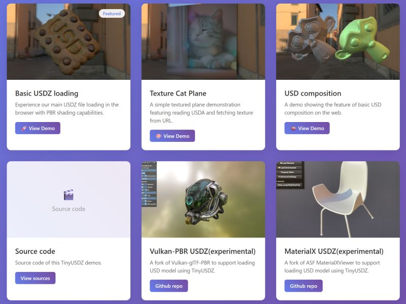

# Tiny USDZ/USDA/USDC library in C++17

`TinyUSDZ` is secure, portable and dependency-free(depends only on C++ STL. Other 3rd-party libraries included. Yes, you don't need pxrUSD/OpenUSD library!) USDZ/USDC/USDA library written in C++17.

[](https://github.com/sponsors/lighttransport)

<p align="center">
 <a href="https://lighttransport.github.io/tinyusdz/demos/", target="_blank">
   
 </a>
</p>

[](https://deepwiki.com/lighttransport/tinyusdz)

[](https://www.npmjs.com/package/tinyusdz)

## Releases

### 26.xx v0.10.x (In development)

* C++17 is now the default: https://github.com/lighttransport/tinyusdz/issues/220
* Robust USDA/USDC/USDZ parsing (production-grade).
* Robust USDA writer.
* USDC(Crate) writer (experimental, binary v0.8.0). See [doc/crate-writer.md](doc/crate-writer.md)
* MaterialX support: XML parsing (v1.36-1.39), OpenPBR Surface, Autodesk Standard Surface, color space conversions, JS MaterialX pipeline. See [doc/materialx.md](doc/materialx.md)
* Tydra: Convert USD model to OpenGL/Vulkan/Three.js friendly scene graph.
  * Tangent computation: MikkTSpace, FastMikkTSpace, Hybrid methods with GPU-friendly quantized formats (INT_2_10_10_10_REV, FP16, SNorm8). See [doc/tydra-tangent.md](doc/tydra-tangent.md)
  * Normal quantization (INT_2_10_10_10_REV, 67% memory savings)
  * Animation support: SkelAnimation, xformOp timeSamples, blend shapes. See [doc/skinning.md](doc/skinning.md)
* USD composition (subLayers, references, payloads, inherits, variants).
  * Nested variant support (up to 3 levels). See [doc/variant.md](doc/variant.md)
* TimeSamples evaluation matching OpenUSD behavior (interpolation, held, extrapolation). See [doc/timesamples.md](doc/timesamples.md)
* JS/WASM binding with Three.js integration. See [doc/threejs.md](doc/threejs.md) and https://github.com/lighttransport/tinyusdz/tree/release/web
* Memory budget system with comprehensive memory estimation and profiling. See [doc/memory-usage-tasks.md](doc/memory-usage-tasks.md)
* MCP(ModelContextProtocol) support (W.I.P.). See [doc/mcp.md](doc/mcp.md)

### 25.07 v0.9.x

* Robust USDA/USDC/USDZ parsing.
* Robust USDA writer.
* Tydra: Convert USD model to OpenGL/Vulkan/Three.js friendly scene graph.
* Basic USD composition.
* JS/WASM binding of TinyUSDZ. https://github.com/lighttransport/tinyusdz/tree/release/web

## Upcoming

* Subdivision surface https://github.com/lighttransport/tinyusdz/tree/subdiv-2025
* Curves(hairs) https://github.com/lighttransport/tinyusdz/tree/curves-2025
* PCP composition(experimental) https://github.com/lighttransport/tinyusdz/issues/262
  * Documentation(w.i.p) https://lighttransport.github.io/tinyusdz/pcp.html
* LTE Spectral API extension (draft). See [doc/lte_spectral_api.md](doc/lte_spectral_api.md)

## Lab project

* LightUSD: https://github.com/lighttransport/tinyusdz/tree/lightusd/sandbox/lightusd
  * USD for 3D genAI/VLM/LLM

## Branches

* `release` Release branch
* `dev` Develop branch(merged into `release` after feature freeze and testing)
  * Basically, use `dev` branch to submit PR 
* `npm` Branch for NPM packaging&upload(developer only)
  
## High priority

* Support MCP interface for AI agents: https://github.com/lighttransport/tinyusdz/issues/243
* [x] MaterialX https://github.com/syoyo/tinyusdz/issues/86
  * [x] Write our own MaterialX parser
  * [x] OpenPBR shading model support https://github.com/lighttransport/tinyusdz/issues/172
  * [ ] USD + MaterialX + OpenPBR rendering verification using pbrlab? https://github.com/lighttransport/pbrlab
* Enhancement for wasm, webgpu https://github.com/syoyo/tinyusdz/issues/118
  * Three.js loader addon(TinyUSDZLoader) https://github.com/lighttransport/tinyusdz/issues/185
* [x] Improve Animation(timeSamples) support in JS/WASM
  * [x] Support rigid node animation(xformOp + timeSamples)
  * [x] Skinning support
  * [x] Convert USD animation data to Three.js friendly format.

## Mid-term todo

* USD import/export feature using TinyUSDZ for robotics/sim2real/digitalTwin/genAI tools https://github.com/lighttransport/tinyusdz/issues/226
* Write/improve examples and demos
  * For Vulkan and Android Vulkan example, please refer https://github.com/syoyo/Vulkan-glTF-USDZ-PBR for a while
  * For OpenGL + MaterialX example, please refer ASF MaterialXViewer fork to load USD model through TinyUSDZ https://github.com/lighttransport/materialx
* Support PLY and point primitive for Gaussian Splatting https://github.com/lighttransport/tinyusdz/issues/190
* Performance optimization https://github.com/syoyo/tinyusdz/issues/164
* [x] Nested variantSet https://github.com/lighttransport/tinyusdz/issues/94
* [x] better colorspace + wide-gamut support https://github.com/syoyo/tinyusdz/issues/142
  * sRGB, ACEScg (AP1), Display P3, Rec.2020, Adobe RGB, CIE XYZ-D65, gamma 2.2/1.8
* Better skinning + blendshapes support
  * Write example using mediapipe for motion tracking and face tracking with rigged USDZ model.
* Improve interoperability with Blender USD export/import https://github.com/syoyo/tinyusdz/issues/98
  * [x] Blender MaterialX export (Principled BSDF -> OpenPBR Surface) support
* Tydra: Handy data structure converter for rendering https://github.com/syoyo/tinyusdz/issues/31
  * [x] USD to RenderScene(OpenGL/Vulkan-like API friendly data structure) conversion https://github.com/syoyo/tinyusdz/issues/109
  * [x] GeomSubset/Material Binding API support for shading/texturing https://github.com/syoyo/tinyusdz/issues/103
* [x] UTF8 Identifier support https://github.com/syoyo/tinyusdz/issues/47
* Collection API
  * [ ] https://github.com/syoyo/tinyusdz/issues/108
* Composition support https://github.com/syoyo/tinyusdz/issues/25
  * [x] subLayers
  * [x] references
  * [x] payload(no delayed load)
  * [x] inherits
  * [x] variantSet
  * [ ] Validate composition is correctly operated.
* Better usdLux support https://github.com/syoyo/tinyusdz/issues/101
* [ ] Support parsing usd-wg USD assets
  * https://github.com/syoyo/tinyusdz/issues/135
* Support reading & compose some production USD scenes
  * [ ] Moana island v2.1 https://github.com/syoyo/tinyusdz/issues/90
  * [ ] ALAB USD production scene https://github.com/syoyo/tinyusdz/issues/91
  * [ ] Activision Caldera scene https://github.com/lighttransport/tinyusdz/issues/184

## Build status

|         |   Linux                                  |  Windows                              |   macOS   |  iOS   | Android |
|:-------:|:---------------------------------------- |:------------------------------------- |:---------:|:------:|:-------:|
| release | [](https://github.com/syoyo/tinyusdz/actions/workflows/linux_ci.yml) | [](https://github.com/syoyo/tinyusdz/actions/workflows/windows_ci.yml) </br> [](https://github.com/syoyo/tinyusdz/actions/workflows/windows_arm_ci.yml)  | [](https://github.com/syoyo/tinyusdz/actions/workflows/macos_ci.yml) | [](https://github.com/syoyo/tinyusdz/actions/workflows/ios_ci.yml) | [](https://github.com/syoyo/tinyusdz/actions/workflows/android_ci.yml) |

## Supported platforms

|         |   Linux                                  |  Windows                              |   macOS   |  iOS   | Android |  WASM(WASI)                    |  WASM(Emscripten) |
|:-------:|:---------------------------------------- |:------------------------------------- |:---------:|:------:|:-------:|:------------------------------:|:-----------:|
| release | ✅ 64bit </br> ✅ 32bit </br> ✅ aarch64 | ✅ 64bit </br> ✅ 32bit </br> ✅ ARM64  |✅         |✅      |✅       |❓ [sandbox/wasi](sandbox/wasi) | ✅ [web](web) |

<!--
### Python binding(testing. currently not working)

https://pypi.org/project/tinyusdz/

Python binding is very early alpha testing stage. Not working at the moment.

You can install Python prebuilt wheel using

```
$ python -m pip install tinyusdz
```

|         |   Linux                                  |  Windows                              |   macOS 11(Big Sur) or later  | macos 10  |
|:-------:|:---------------------------------------- |:------------------------------------- |:-----------------------------:|:---------:|
|   3.6(⚠️)   | ✅ 64bit </br> ✅ 32bit </br> ✅ aarch64 | ✅ 64bit </br> ✅ 32bit </br> ✅ ARM64  |🚫 | ✅ Intel |
|   3.7   | ✅ 64bit </br> ✅ 32bit </br> ✅ aarch64 | ✅ 64bit </br> ✅ 32bit </br> ✅ ARM64  |✅ arm64 | 🚫 universal2 </br> ✅ Intel |
|   3.8   | ✅ 64bit </br> ✅ 32bit </br> ✅ aarch64 | ✅ 64bit </br> ✅ 32bit </br> ✅ ARM64  |✅ arm64 | ✅ universal2 </br> ✅ Intel |
|   3.9   | ✅ 64bit </br> ✅ 32bit </br> ✅ aarch64 | ✅ 64bit </br> ✅ 32bit </br> ✅ ARM64  |✅ arm64 | ✅ universal2 </br> ✅ Intel |
|   3.10   | ✅ 64bit </br> ✅ 32bit </br> ✅ aarch64 | ✅ 64bit </br> ✅ 32bit </br> ✅ ARM64  |✅ arm64 | ✅ universal2 </br> ✅ Intel |
|   3.11   | ✅ 64bit </br> ✅ 32bit </br> ✅ aarch64 | ✅ 64bit </br> ✅ 32bit </br> ✅ ARM64  |✅ arm64 | ✅ universal2 </br> ✅ Intel |

⚠️  Python 3.6 is EOL and not recommended to use it. 3.6 bwheels is provided as long as cibuildwheels provides the build for it.
NOTE: Windows ARM64 binary is provided using cross-compiling. Its not well tested.

-->

## Status

Core loading feature(both USDA and USDC) is now working and production-grade(And no seg fault for corrupted USDA/USDC/USDZ input).
Tydra framework for rendering USD model with OpenGL/Vulkan/Three.js-like renderer is production-ready with MaterialX support.

### Thread Safety

**Important:** The TinyUSDZ API is **not thread-safe**. Core classes (`Stage`, `Prim`, `Layer`, `PrimSpec`) do not provide internal synchronization. Applications must implement their own synchronization mechanisms (e.g., mutexes, locks) when accessing these objects from multiple threads concurrently.

### Parsing and Writing

* [x] USDZ/USDC(Crate) parser
  * USDC Crate version v0.8.0(most commonly used version as of 2022 Nov) or higher is supported.
* [x] USDC(Crate) writer (experimental, Crate v0.8.0). See [doc/crate-writer.md](doc/crate-writer.md)
  * Geometry, Materials, Lights, Skeletal animation, Metadata, Composition arcs, TimeSamples
* [x] USDA parser(Hand-written from a scratch. No Bison/Flex dependency!)
* [x] USDA writer (production)
* [x] Support basic Primitives(Xform, Mesh, BasisCurves, GeomPoints, GeomCamera, GeomNurbsCurves, GeomSubset, GeomPointInstancer, Cone, Cylinder, Capsule, etc.), basic Lights(SphereLight, RectLight, DistantLight, DomeLight) and Shaders(UsdPreviewSurface, UsdUVTexture, UsdPrimvarReader, UsdTransform2d)

### Composition

* [x] subLayers
* [x] references
* [x] payload
* [x] inherits
* [x] variants (including nested variants up to 3 levels). See [doc/variant.md](doc/variant.md)
* [ ] specializes

### MaterialX

* [x] MaterialX XML parsing (v1.36-1.39)
* [x] OpenPBR Surface, Autodesk Standard Surface, UsdPreviewSurface shader support
* [x] Color space conversions (sRGB, ACEScg, Display P3, Rec.2020, Adobe RGB, CIE XYZ, gamma)
* [x] StandardSurface to OpenPBR conversion
* [x] Tydra: NodeGraph traversal with texture/normal/tangent extraction
* [x] JS: OpenPBR to Three.js MeshPhysicalMaterial conversion
* [x] JS: NodeGraph optimizer (identity removal, pattern recognition, constant folding)
* See [doc/materialx.md](doc/materialx.md) for full details

### Tydra (Render Data Conversion)

* [x] USD Stage to RenderScene(OpenGL/Vulkan-friendly) conversion
* [x] Multiple tangent computation methods (Lengyel, MikkTSpace, FastMikkTSpace, Hybrid)
* [x] Tangent/Normal quantization (INT_2_10_10_10_REV, FP16, SNorm8)
* [x] Skeletal animation (SkelAnimation, blend shapes, joint TRS)
* [x] xformOp timeSamples animation
* [x] TimeSamples evaluation matching OpenUSD behavior
* [x] Comprehensive memory estimation (`estimate_memory_usage()` API)
* See [doc/tydra-tangent.md](doc/tydra-tangent.md), [doc/skinning.md](doc/skinning.md), [doc/timesamples.md](doc/timesamples.md)

### Other

* [x] Web/WASM demo with Three.js integration. See [doc/threejs.md](doc/threejs.md)
* [x] Memory budget system for secure loading. See [doc/memory-usage-tasks.md](doc/memory-usage-tasks.md)
* [x] Unregistered value handling (matching OpenUSD behavior). See [doc/unregistered-value.md](doc/unregistered-value.md)
* [ ] Basic C API(`c-tinyusd`) for language bindings
* [ ] MCP(ModelContextProtocol) support (W.I.P.). See [doc/mcp.md](doc/mcp.md)
* [ ] USD <-> glTF converter example
  * There is an independent work of USD to glTF binary GLB converter: https://github.com/fynv/usd2glb


## Discussions

We've opened Github Discussions page! https://github.com/syoyo/tinyusdz/discussions

### Security and memory budget

TinyUSDZ has first priority of considering security and stability.

USDZ(USDC) is a binary format. To avoid out-of-bounds access, out-of-memory, and other security issues when loading malcious USDZ(e.g. USDZ file from unknown origin), TinyUSDZ has a memory budget feature to avoid out-of-memory issue.

To limit a memory usage when loading USDZ file, Please set a value `max_memory_limit_in_mb` in USDLoadOptions.

TinyUSDZ source codes(and some external third party codes) are also checked by Address Sanitizer, CodeQL and Fuzzer.

#### Fuzzer 

See [tests/fuzzer](tests/fuzzer) .
For building fuzzer tests, you'll need Meson and Ninja.

#### Web platform(WASM) and sandboxed environment(WASI)

If you need to deal with arbitrary USD files from unknown origin(e.g. from internet, NFT storage. Whose may contain malcious data), it is recommended to use TinyUSDZ in sandboxed environment(RunC, FlatPak, WASI(WASM)). Run in WASI is recommended at the moment.

TinyUSDZ does not use C++ exceptions and can be built without threads. TinyUSDZ supports WASM and WASI build. So TinyUSDZ should runs well on various Web platform(WebAssembly. No SharedArrayBuffer, Atomics and WebAssembly SIMD(which is not yet available on iOS Safari) required) and sandboxed environment(WASI. Users who need to read various USD file which possibly could contain malcious data from Internet, IPFS or blockchain storage). 

See [sandbox/wasi/](sandbox/wasi) for Building TinyUSDZ with WASI toolchain.

### Tydra

USD itself is a generic container of 3D scene data.

Tydra is an interface to Renderers/Viewers and other DCCs.
Tydra may be something like Tiny version of pxrUSD Hydra, but its API is completely different. See [src/tydra/README.md](src/tydra/README.md) for the background.

## Notice

TinyUSDZ does not support Reality Composer file format(`.reality`) since it uses proprietary file format and we cannot understand it(so no conversion support from/to Reality also).

## Sponsorship and Commercial support

TinyUSDZ focuses on loading/writing USDA/USDC/USDZ functionalities.
Example viewer is just for demo purpose.

If you need commercial support, eco-system development(e.g. plug-ins, DCC tools on top of TinyUSDZ) or production-grade USDZ model viewer(e.g. embed TinyUSDZ to your AR app, 3D NFT Android mobile viewer capable of displaying (encrypted) USDZ model), please contact Light Transport Entertainment, Inc. : [https://goo.gl/forms/1p6uGcOKWGpXPHkA2 ](https://forms.gle/PeDRAgYM5ET9SjGs5)

We are also looking for sponsors. If you are interested in sponsoring(or donating to) TinyUSDZ project, use Github Sponsors to sponsor TinyUSDZ propject, or contact Light Transport Entertainment, Inc. for details: [https://goo.gl/forms/1p6uGcOKWGpXPHkA2 ](https://forms.gle/PeDRAgYM5ET9SjGs5)


## Projects using TinyUSDZ

* Vulkan-glTF-USDZ-PBR: Example to draw USD model using Vulkan https://github.com/syoyo/Vulkan-glTF-USDZ-PBR
* usd2glb: USD to glTF 2.0 GLB converter https://github.com/fynv/usd2glb
* webgpu-cpp-usdz: WebGPU C++/Wasm USDZ Renderer(NOTE: It doesn't support much yet!) https://github.com/Twinklebear/webgpu-cpp-usdz
* A secret project (*/ω＼*)
* Several DCC tools, plugins
* Your projects here!(Please send PR)

### Other related projects

* UsdzSharpie: C# Simple implementation of Usdz file format ( https://github.com/UkooLabs/UsdzSharpie )
* TinyGLTF: glTF 2.0 loader/saver ( https://github.com/syoyo/tinygltf )


## Supported platforms

* [x] Linux 64bit or later
  * [x] ARM AARCH64
  * [x] x86-64
  * [ ] RISC-V(Should work)
  * [ ] SPARC, POWER(Big endian machine). May work(theoretically)
* [x] Android arm64v8a
* [x] iOS
* [x] macOS(Arm, x86-64)
* [x] Windows 10 64bit or later
  * [x] Windows ARM
  * [x] clang-cl + MSVC SDK cross compile
* [x] WebAssembly
  * Emscripten
    * See [web/demo](web/demo).
* [x] WASI(through WASI toolchain)
  * See [sandbox/wasi](sandbox/wasi)

## Requirements

* C++17 compiler
  * [x] gcc 7 or later (gcc 9+ recommended)
  * [x] Visual Studio 2019 or later. 2022 recommended.
    * You can use `CMakePresets.json`, but seems a bit troublesome in VS2022 https://github.com/lighttransport/tinyusdz/pull/182#issuecomment-2236676598 . If you encounter an issue, use `vcsetup.bat` to setup .sln for a while.
    * [x] Can be compiled with standalone MSVC compilers(Build Tools for Visual Studio 2019)
  * [x] clang 5 or later https://clang.llvm.org/cxx_status.html
  * [x] llvm-mingw(clang) supported
  * [x] MinGW gcc supported, but not recommended(You may got compilation failure depending on your build configuration: https://github.com/syoyo/tinyusdz/issues/33 , and linking takes too much time if you use default bfd linker.). If you want to compile TinyUSDZ in MinGW environment, llvm-mingw(clang) is recommended to use.

Compilation with C++20 is also supported (required for coroutine support via `TINYUSDZ_WITH_COROUTINE`).

## Build

### Integrate to your app

If you are using CMake, just include tinyusdz repo with `add_subdirectory` and set include path to `<tinyusdz>/src`
We recommend to use CMake 3.24 or later.
(Mininum requirement is 3.16)

```cmake

...

# TinyUSDZ examples, tests and tools builds are disabled by default when
# tinyusdz is being built as a library with `add_subdirectory`
add_subdirectory(/path/to/tinyusdz tinyusdz)

target_include_directories(YOUR_APP PRIVATE "/path/to/tinyusdz/src")

# Namespaced static library target `tinyusdz::tinyusdz_static` is provided.
# At the moment we recommend to use static build of TinyUSDZ. 
# You can use alias target `tinyusdz_static` also for legacy cmake version. 
target_link_libraries(YOUR_APP PRIVATE tinyusdz::tinyusdz_static)

# For TinyUSDZ DLL(shared) library target, you can use
# `tinyusdz` library target  
```

Another way is simply copy `src` folder to your app, and add `*.cc` files to your app's build system.
All include paths are set relative from `src` folder, so you can just add include directory to `src` folder.

See `<tinyusdz>/CMakeLists.txt` and [examples/sdlviewer/CMakeLists.txt](examples/sdlviewer/CMakeLists.txt) for details.

TinyUSDZ does not generate any header files and source files before the build and after the build(before the installation stage), so you don't need to take care of any pre-processing and post-processing of source tree. For example, USD Ascii parser uses hand-written C++ code so no Bison/flex/PEG processing involved.

It may not be recommend to use tinyusdz as a git submodule, since the repo contains lots of codes required to build TinyUSDZ examples but these are not required for your app.

### Compiler defines

Please see `CMake build options` and `CMakeLists.txt`. In most case same identifier is defined from cmake build options: For example if you specify `-DTINYUSDZ_PRODUCTION_BUILD=1` for cmake argument, `TINYUSDZ_PRODUCTION_BUILD` is defined.

### CMake

Cmake build is provided.

#### Linux and macOS

```
$ mkdir build
$ cd build
$ cmake ..
$ make
```

Please take a look at `scripts/bootstrap-cmake-*.sh` for some build configuraions.

#### Visual Studio

Visual Studio 2019 and 2022 are supported.

`CMakePresets.json` is provided for easier build on Visual Studio 2019 and Visual Studio 2022, but has lot of limitations(and seems parallel build is not working well so build is slow).

If you want flexibility, ordinary cmake `.sln` generation approach by invoking `vcsetup.bat` recommended.
(Edit VS version in `vcsetup.bat` as you with before the run)

#### LLVM-MinGW build

MinGW native and cross-compiling example using llvm-mingw(clang) is provided.
See `scripts/bootstrap-cmake-mingw-win.sh` and `scripts/bootstrap-cmake-llvm-mingw-cross.sh` for details. 

One of benefit to use llvm-mingw is address sanitizer support on Windows app.

To run app(`.exe`, you'll need `libunwind.dll` and `libc++.dll` on your working directory or search path)

For Windows native build, we assume `ninja.exe` is installed on your system(You can use it from Meson package)

#### CMake build options

* `TINYUSDZ_PRODUCTION_BUILD` : Production build. Do not output debugging logs.
* `TINYUSDZ_BUILD_TESTS` : Build tests
* `TINYUSDZ_BUILD_EXAMPLES` : Build examples(note that not all examples in `examples` folder are built)
* `TINYUSDZ_WITH_OPENSUBDIV` : Use OpenSubviv to tessellate subdivision surface.
  * OpenSubdiv code is included in TinyUSDZ repo. If you want to use external OpenSubdiv repo, specity the path to OpenSubdiv using `osd_DIR` cmake environment variable.
* `TINYUSDZ_WITH_AUDIO` : Support loading audio(mp3 and wav).
* `TINYUSDZ_WITH_EXR` : Support loading EXR format HDR texture through TinyEXR.
* `TINYUSDZ_WITH_PXR_COMPAT_API` : Build with pxrUSD compatible API.

#### clang-cl on Windows

Assume ninja.exe is installed and path to ninja.exe is added to your `%PATH%`

Edit path to MSVC SDK and Windows SDK in `bootstrap-clang-cl-win64.bat`, then

```
> bootstrap-clang-cl-win64.bat
> ninja.exe
```


### Tools and Examples

* [tusdcat](examples/tusdcat/) Parse USDZ/USDA/USDC and print it as Ascii(similar to `usdcat` in pxrUSD).
  * `tusdcat` also does USD composition(`flatten`) and contains TinyUSDZ Composition API usecase.
  * Supports USDA to USDC conversion: `tusdcat input.usda -o output.usdc`
* Deprecated. Use `tusdcat` [usda_parser](examples/usda_parser/) Parse USDA and print it as Ascii.
* Deprecated. Use `tusdcat` [usdc_parser](examples/usdc_parser/) Parse USDC and print it as Ascii.
* [Simple SDL viewer](examples/sdlviewer/)
  * Separated CMake build provided: See [Readme](examples/sdlviewer/README.md)
* [api_tutorial](examples/api_tutorial/) Tutorial of TinyUSDZ Core API to construct a USD scene data.
* [tydra_api](examples/tydra_api/) Tutorial of TinyUSDZ Tydra API to access/query/convert a USD scene data.
* [asset_resolution](examples/asset_resolution/) Tutorial of using AssetResolutionResolver API to load USD from customized I/O(e.g. from Memory, Web, DB, ...)
* [file_format](examples/file_format/) Tutorial of using custom FileFormat handler to load Prim data in custom fileformat.

See [examples](examples) directory for more examples, but may not actively maintained except for the above examples.

#### Examples as external project

* Vulkan rendering of USDZ model by extending Vulkan-glTF-PBR https://github.com/syoyo/Vulkan-glTF-USDZ-PBR
  * Uses `rendermesh-refactor` branch
  
### USD Data format and Documentation

See [doc/](doc/) directory for detailed documentation:

* [doc/materialx.md](doc/materialx.md) - MaterialX support (shaders, color spaces, NodeGraph, Three.js integration)
* [doc/skinning.md](doc/skinning.md) - UsdSkel skinning (LBS, DQS, blend shapes, Tydra export)
* [doc/crate-writer.md](doc/crate-writer.md) - USDC binary writer
* [doc/variant.md](doc/variant.md) - USD Variant support
* [doc/timesamples.md](doc/timesamples.md) - TimeSamples evaluation
* [doc/tydra-tangent.md](doc/tydra-tangent.md) - Tangent computation and quantization
* [doc/memory-usage-tasks.md](doc/memory-usage-tasks.md) - Memory profiling and optimization
* [doc/unregistered-value.md](doc/unregistered-value.md) - Unregistered value handling
* [doc/threejs.md](doc/threejs.md) - Three.js integration (animation, MaterialX)
* [doc/mcp.md](doc/mcp.md) - MCP (Model Context Protocol) support
* [doc/python_binding.md](doc/python_binding.md) - Python binding

## Example

### Minimum example to load USDA/USDC/USDZ file.

```
// TinyUSDZ is not a header-only library, so no TINYUSDZ_IMPLEMENTATIONS
#include "tinyusdz.hh"

// Include pprinter.hh and value-pprint.hh if you want to print TinyUSDZ classes/structs/enums.
// `tinyusdz::to_string()` and `std::operator<<` for TinyUSDZ classes/enums are provided separately for faster compilation
#include <iostream>
#include "pprinter.hh"
#include "value-pprint.hh"

int main(int argc, char **argv) {

  std::string filename = "input.usd";

  if (argc > 1) {
    filename = argv[1];
  }

  tinyusdz::Stage stage; // Stage in USD terminology is nearly meant for Scene in generic 3D graphics terminology.
  std::string warn;
  std::string err;

  // Auto detect USDA/USDC/USDZ
  bool ret = tinyusdz::LoadUSDFromFile(filename, &stage, &warn, &err);

  if (warn.size()) {
    std::cout << "WARN : " << warn << "\n";
  }

  if (!ret) {
    if (!err.empty()) {
      std::cerr << "ERR : " << warn << "\n";
    }
    return EXIT_FAILURE;
  }

  // Print Stage(Scene graph)
  std::cout << tinyusdz::to_string(stage) << "\n";
  
  // You can also use ExportToString() as done in pxrUSD 
  // std::cout << stage.ExportToString() << "\n";

  // stage.metas() To get Scene metadatum, 
  for (const Prim &root_prim : stage.root_prims()) {
    std::cout << root_prim.absolute_path() << "\n";
    // You can traverse Prim(scene graph object) using Prim::children()
    // See examples/api_tutorial and examples/tydra_api for details.
  }

  return EXIT_SUCCESS;
}
```

### With Core TinyUSDZ API

Please see [api_tutorial](examples/api_tutorial/)

### With Tydra API

Please see [tydra_api](examples/tydra_api/)


## TODO

### Higher priority

* [x] Support Crate(binary) version 0.8.0(USD v20.11 default)
* [x] Read USD data with bounded memory size. This feature is especially useful for mobile platform(e.g. in terms of security, memory consumption, etc)
* [x] USDC writer (experimental). See [doc/crate-writer.md](doc/crate-writer.md)
* [x] MaterialX support. See [doc/materialx.md](doc/materialx.md)
  * [x] MaterialX XML parsing (v1.36-1.39)
  * [x] OpenPBR Surface, StandardSurface, UsdPreviewSurface shader support
  * [x] Color space conversions
  * [ ] Procedural nodes (`noise2d`, `fractal3d`)
  * [ ] MaterialX `<xi:include>` / library resolution

### Middle priority

* [ ] Support Nested USDZ
* [ ] UDIM texture support
* [x] usdSkel utilities. See [doc/skinning.md](doc/skinning.md)
  * [x] Joint hierarchy reconstruction and compute skinning matrix(usdSkel)
  * [x] Blend shapes (basic)
  * [ ] In-between blend shapes
* [ ] Built-in usdObj(wavefront .obj mesh) support via tinyobjloader.
* [ ] Composition arcs
  * [x] Basic composition (subLayers, references, payloads, inherits, variants)
  * [ ] Advanced composition (specializes)
  * [ ] USDC writer variant/variantSet specs
* [ ] Code refactoring, code optimization

### Lower priority

* [ ] iOS example?
* [ ] Support AR related schema(Game-like feature added by Reality Composer?)
* [ ] Audio play support
  * [ ] Play audio using SoLoud or miniaudio(or Oboe for Android)
  * [ ] wav(dr_wav)
  * [ ] mp3(dr_mp3)
  * [ ] m4a(ALAC?)
* [ ] Viewer with Vulkan API.
* [ ] Replace OpenSubdiv with our own subdiv library.
* [ ] Write parser based on the schema definition.
* [ ] Support big endian architecture.

## Python binding and prebuilt packages

Python binding and prebuilt packages(uploaded on PyPI) are provided.

See [python/README.md](python/README.md) and [doc/python_binding.md](doc/python_binding.md) for details.

## CI build

CI build script is a build script trying to build TinyUSDZ in self-contained manner as much as possible(including custom Python build)

## Build with Sanitizers

See wiki page: https://github.com/lighttransport/tinyusdz/wiki/Building-TinyUSDZ-with-Sanitizers  

### Linux/macOS

T.B.W.

### Windows

Build custom Python,

```
> ci-build-python-lib.bat
```

then build TinyUSDZ by linking with this local Python build.

```
> ci-build-vs2022.bat
```

#### Cross compile with clang-cl + MSVC SDK on linux and run it on WINE(No Windows required at all solution!)

clang-cl(MSVC cl.exe) + MSVC SDK cross compile is also supported.

Please take a look at [doc/wine_cl.md](doc/wine_cl.md)

You can build pure Windows build of TinyUSDZ on Linux CI machine.

## License

TinyUSDZ is primarily licensed under Apache 2.0 license.
Some helper code is licensed under MIT license.

### Third party licenses

* pxrUSD : Apache 2.0 license. https://github.com/PixarAnimationStudios/USD
* OpenSubdiv : Apache 2.0 license. https://github.com/PixarAnimationStudios/OpenSubdiv
* lz4 : BSD-2 license. http://www.lz4.org
* cnpy(uncompressed ZIP decode/encode code) : MIT license https://github.com/rogersce/cnpy
* tinyexr: BSD license.
* tinyobjloader: MIT license.
* tinygltf: MIT license.
* tinycolorio: MIT license. https://github.com/syoyo/tinycolorio
* stb_image, stb_image_resize, stb_image_write, stb_truetype: public domain. 
* dr_libs: public domain. https://github.com/mackron/dr_libs
* miniaudio: public domain or MIT no attribution. https://github.com/dr-soft/miniaudio
* SDL2 : zlib license. https://www.libsdl.org/index.php
* optional-lite: BSL 1.0 license. https://github.com/martinmoene/optional-lite
* expected-lite: BSL 1.0 license. https://github.com/martinmoene/expected-lite
* span-lite: BSL 1.0 license. https://github.com/martinmoene/span-lite
* string-view-lite: BSL 1.0 license. https://github.com/martinmoene/string-view-lite
* mapbox/earcut.hpp: ISC license. https://github.com/mapbox/earcut.hpp
* par_shapes.h generate parametric surfaces and other simple shapes: MIT license https://github.com/prideout/par
* MaterialX: Apache 2.0 license. https://github.com/AcademySoftwareFoundation/MaterialX
* string_id: zlib license. https://github.com/foonathan/string_id
* cityhash: MIT license. https://github.com/google/cityhash
* fast_float: Apache 2.0/MIT dual license. https://github.com/fastfloat/fast_float
* jsteeman/atoi: Apache 2.0 license. https://github.com/jsteemann/atoi
* formatxx: unlicense. https://github.com/seanmiddleditch/formatxx
* ubench.h: Unlicense. https://github.com/sheredom/ubench.h
* thelink2012/any : BSL-1.0 license. https://github.com/thelink2012/any
* simple_match : BSL-1.0 license. https://github.com/jbandela/simple_match
* nanobind : BSD-3 license. https://github.com/wjakob/nanobind
* pybind11 : BSD-3 license. https://github.com/pybind/pybind11
* pystring : BSD-3 license. https://github.com/imageworks/pystring
* gulrak/filesytem : MIT license. https://github.com/gulrak/filesystem
* p-ranav/glob : MIT license. https://github.com/p-ranav/glob
* linalg.h : Unlicense. https://github.com/sgorsten/linalg
* mapbox/eternal: ISC License. https://github.com/mapbox/eternal
* bvh: MIT license. https://github.com/madmann91/bvh
* dtoa_milo.h: MIT License. https://github.com/miloyip/dtoa-benchmark
* jeaiii/itoa: MIT License. https://github.com/jeaiii/itoa
* alac: Apache 2.0 License. https://macosforge.github.io/alac/
* OpenFBX: MIT License. https://github.com/nem0/OpenFBX
* floaxie: Apache 2.0 License. https://github.com/aclex/floaxie
* boost math sin_pi/cos_pi: BSL 1.0 License. https://www.boost.org/
* Vulkan: MIT License. https://github.com/SaschaWillems/Vulkan
* Metal.cpp: Apache 2.0 License. https://github.com/bkaradzic/metal-cpp https://developer.apple.com/metal/cpp/
* sRGB transform: MIT license. https://www.nayuki.io/page/srgb-transform-library
* virtualGizmo3D: BSD-2 license. https://github.com/BrutPitt/virtualGizmo3D
* nanozlib: Apache 2.0 license. https://github.com/lighttransport/nanozlib
* lz4.py: MIT license. https://github.com/SE2Dev/PyCoD/blob/master/_lz4.py
* pugixml: MIT license. https://github.com/zeux/pugixml
* nanoflann: 2-clause BSD license. https://github.com/jlblancoc/nanoflann
* tinymeshutils: MIT license. https://github.com/syoyo/tinymeshutils
* dragonbox : Apache 2.0 or Boost 1.0 license(tinyusdz prefer Boost 1.0 license) https://github.com/jk-jeon/dragonbox
* criterion(for benchmark): MIT license. https://github.com/p-ranav/criterion
* yyjson: MIT license. https://github.com/ibireme/yyjson
* civetweb: MIT license. https://github.com/civetweb/civetweb
* libsais: Apache 2.0 license. https://github.com/IlyaGrebnov/libsais
* quickjs-ng: MIT license: https://github.com/quickjs-ng/quickjs
* meshoptimizer: MIT license: https://github.com/zeux/meshoptimizer
* mikktspace: mikktspace license(zlib-like): https://github.com/mmikk/MikkTSpace
* xxHash: BSD-2 license. https://github.com/Cyan4973/xxHash
