# Loading large USD scenes in TinyUSDZ

Production USD scenes are 10–20 GB on disk, spread across thousands of payloaded
files. This document analyzes three publicly-available scenes — **Moana Island**
(Disney), **ALab** (Animal Logic), and **Caldera** (Activision) — and describes
how TinyUSDZ loads them within a bounded RAM budget (target: **fit a parse into
16 GB**, geometry deferred), plus the remaining implementation work.

See also [instancing.md](instancing.md) for the Island instancing analysis, and
[benchmarks.md](benchmarks.md) for middle-scale public scenes
(Pixar Kitchen_set, Intel Moore Lane) that render interactively *without* the
large-scene budgeting flags described here.

## Why it is hard

| Challenge | Consequence |
|---|---|
| Tens of thousands of files | per-file open/parse cost; must parse each once |
| Geometry behind `payload` arcs | must be deferred, not loaded eagerly |
| Deep reference/variant nesting | composition must be lazy and bounded |
| Cross-directory `..`-relative asset paths | resolver must anchor each arc to its layer's directory |
| Multi-GB single files (splats, point caches) | must stream / mmap, not buffer wholesale |

The lever that makes these scenes fit is **payload deferral** (load the
composition structure, leave geometry on disk) combined with **parse-once layer
sharing** and **LOD/proxy variant selection** — *not* mmap (see §Roadmap).

---

## 1. Scene structures

### 1.1 Moana Island (`/mnt/disk1/data/island`, ~17 GB)

Root `usd/island.usda` (~22 KB) — a single `Xform "island"` (kind `assembly`)
with 20 element children via `prepend references`. Each element uses a
three-file pattern (`element.usda` → `instance.usda` → `geometry.usda`) with
`prepend payload` to binary `model.usd` + XGen archives.

| Metric | Value |
|---|---|
| Composition style | scenegraph instancing + payloads |
| `instanceable = true` prototypes | 60 |
| component instances | 101 |
| `references` / `payload` | 3,924 / 214 |
| top-level `PointInstancer` | 0 (XGen instancing baked in binary `.usd`) |
| largest file | `xgGroundCover.usd` 652 MB |

### 1.2 ALab v2.3.0 (`/mnt/disk1/data/alab/v2.3.0.zip`, ~4 GB USD in-zip)

Root `ALab/entry.usda` (309 B) composes via **subLayers**. Entities use
subLayers for department contributions (`modelling`/`surfacing`/`preview`) +
`references` into `fragment/` + **variant-selected payloads** for geometry LOD
(`geo` = base / render_high / display_high / collision / …), `instanceable`
assembly references, and `inherits`/`specializes` against `__class__`.

| Metric | Value |
|---|---|
| Composition style | subLayers + references + variants + payloads |
| USD files | ~4,298 (mostly tiny `.usda` metadata; geometry in `.usdc` payloads) |
| unique entities | 380 |
| `PointInstancer` | 0 (reference-based instancing) |
| largest files | `alab_sdr_splat.usdc` 537 MB, `alab_hdr_splat.usdc` 382 MB |

ALab is the canonical "payload everything" scene: a typical working set loads
only the chosen geometry LOD per asset (~80 % of geometry stays deferred).

### 1.3 Caldera (`/mnt/disk1/data/caldera`, 9.7 GB)

Root `caldera.usda` (text) → 4 subLayers
(`map_source/mp_wz_island.usd` + `cameras`/`breadcrumbs`/`endpoints`). The root
also authors `over` prims selecting the `districtLod = "proxy"` variant for each
map district. **63,684 files, all binary crate except the text root.**

| Metric | Value |
|---|---|
| Composition style | subLayers + variant-driven LOD + payload-deferred geometry |
| `payload` | 17,299 |
| `variantSet` (LOD `districtLod = proxy\|full`) | 8,066 |
| `references` | 4,252 |
| `PointInstancer` | 14 (clutter) |
| geometry | `assets/xmodel/generated_splined/` 4.9 GB (25.6k crate files) behind payloads |
| proxies | `assets/xmodel/generated_proxies/` 177 MB (loaded for `districtLod=proxy`) |
| player data | `layers/breadcrumbs.usd` 43 MB + `endpoints.usd` 27 MB (`Points`) |

References are `..`-relative across directories (e.g.
`@../../xmodel/.../model.geo.usd@`), which the loader must allow.

### Memory-fit summary

| Scene | LoadNone / proxy working set | Full |
|---|---|---|
| Island | structure only, << 1 GB | ~17 GB |
| ALab | metadata ~0.9 GB | textures 7.3 GB + geometry |
| Caldera | structure ~1.4 GB (measured) | ~10 GB |

All three fit a structural parse well under 16 GB when payloads are deferred.

---

## 2. The TinyUSDZ loading strategy

### 2.1 `LargeSceneLoader` (`src/large-scene-loader.{hh,cc}`)

A one-call, memory-bounded loader that wires the existing primitives together
and **keeps the composition graph alive** so geometry can be streamed in later:

```cpp
tinyusdz::LargeSceneLoadOptions opts;
opts.payload_mode = PayloadMode::LoadNone;       // defer all geometry payloads
opts.allow_parent_relative_paths = true;         // Caldera '..' paths
opts.dedup_layers = true;                        // parse each file once

tinyusdz::LargeSceneLoader loader;
loader.Load("caldera.usda", opts, &warn, &err);

loader.stage();                                  // composed structure
auto snapshot = loader.stage_snapshot();         // immutable, worker-safe view
loader.deferred_payload_paths();                 // geometry not yet loaded
loader.load_payload(path, &warn, &err);          // may run on a worker; rebuilds
```

Pipeline: `LoadLayerFromFile` (root) → `CompositeSublayers` (L phase) →
`CompositionGraph::Compose` with a payload policy → `BuildStage`. The loader
owns the resolver, `pcp::LayerRegistry`, flattened root, and `CompositionGraph`
together so `load_payload`/`unload_payload`/`deferred_payload_paths` work after
the initial load. Loading or unloading a payload now refreshes the payload
node's own arcs plus the composed descendant PrimIndices under that prim before
Stage publication, so children that exist only inside streamed geometry appear
on load and disappear again on unload; nested relative arcs inside the streamed
payload resolve against the payload file's directory; deferred-payload queries
report only payloads still in the deferred state.

Payload graph/cache mutations are serialized. `load_payload` and
`unload_payload` build a replacement Stage and publish it only after the build
succeeds, so they may run on a worker thread. Render/traversal code that overlaps
streaming must hold `stage_snapshot()`; its immutable Stage remains alive while
the loader publishes a newer snapshot. The legacy `stage()` reference remains
for single-threaded callers.

### 2.2 Payload modes

| Mode | Behavior |
|---|---|
| `LoadNone` | defer every payload (lightest; geometry streamed later) — default |
| `LoadAll` | eager (may exceed RAM on huge scenes) |
| `Budget(mb)` | load payloads until a byte budget of asset file sizes is reached, then defer the rest; an optional `payload_extent_budget` adds a projected `extentsHint`-area cap |

The policy is passed to `CompositionGraphOptions`; the extended
`payload_policy_with_prim` callback also receives the authoring `PrimSpec`, so it
can inspect `extentsHint` without breaking existing two-argument policies.
Deferred payloads are recorded in the graph and retrievable via
`GetDeferredPayloadPaths()`. `LargeSceneLoadOptions::payload_extent_budget` is
opt-in (`0` disables it) and caps the cumulative view-independent projected AABB
area (`max(XY, XZ, YZ)`, squared stage units) alongside the byte cap. Payloads
without a valid hint retain byte-only behavior.

### 2.3 Parse-once layer sharing

With `dedup_layers`, the loader installs `pcp::LayerRegistry`
(`src/pcp/layer-registry.hh`) through the new `CompositionGraphOptions`
layer-loading seam (`load_layer_fn` / `load_layer_userdata`). Each referenced
file is resolved + parsed exactly once and shared across every prim that
references it — essential for the tens of thousands of repeated prefab
references in Caldera.

### 2.4 `..`-relative paths

`CompositionGraphOptions::allow_parent_relative_paths` (added in this work)
threads through the reference/payload/`LoadPayload` asset-path validation so
`..` segments are permitted and delegated to the resolver. Without it the DAG
engine rejected such arcs (Caldera composes to almost nothing).

### 2.5 Example / benchmark

`examples/large-scene-load/` loads a scene and reports process RSS (from
`/proc/self/status` VmRSS — the trustworthy peak gauge), deferred-payload count,
unique files parsed, and estimated Stage memory; with `--load-some=N` it streams
in deferred payloads to demonstrate on-demand geometry.

```
large-scene-load <scene.usd[a]> [--mode=none|all|budget] [--budget-mb=N]
                                [--no-dedup] [--load-some=N] [--unload]
```

### 2.5.1 ALab per-element geometry, textures, and procedurals

Before loading the complete ALab set, representative elements were measured
individually from `/mnt/disk1/data/alab/_merged_ALab` with `tusdview --next`,
`--load-payloads`, the `alab` large-scene profile, one headless Vulkan frame at
time 1004, and `--timing`. Geometry-only cases use the modelling fragment;
full cases use the entity layer, which adds surfacing/lighting and filesystem
textures. `lab_workbench01` is the closest bounded set element to a kitchen
work area; the extracted entity tree has no element literally named Kitchen.

| Case | Compose s | Convert s | Load total s | Meshes | ntris | Materials/textures | Peak RSS MiB | Upload / present | Result |
|---|---:|---:|---:|---:|---:|---:|---:|---:|---|
| Portable TV geometry-only | 0.010 | 0.022 | 0.033 | 5 | 64,693 | 4/0 | 250 | 0.01 s / 0.9 ms | pass |
| Portable TV full textured entity | 0.006 | 0.107 | 0.114 | 2 | 51,997 | 3/2 | 259 | 0.00 s / 0.5 ms | pass |
| Stoat body geometry-only | 0.013 | 0.057 | 0.072 | 3 | 80,856 | 3/0 | 243 | 0.01 s / 1.0 ms | pass |
| Stoat full character entity | 0.080 | 0.387 | 0.520 | 12 | 566,344 | 13/5 | 454 | 0.05 s / 0.6 ms | pass |
| `lab_workbench01` full textured set element | 0.902 | 6.694 | 16.250 | 538 | 3,586,150 | 336/276 | 2,114 | 0.34 s / 63.6 ms | pass |
| Baked procedurals `main.usda` (no variant override) | 0.230 | — | — | 0 | 0 | 1/0 | 376 | — / 1.1 ms | no renderable geometry |
| Baked procedurals, `alfro=render` selected | 0.038 | 0.000 | 0.630 | 0 | 0 | 3/0 | 554 | — / 541.0 ms | Curves conversion failed |

The procedural package is present at `/mnt/disk1/data/alab/usd/baked_procedurals`;
the merged `baked_procedurals/main.usda` is only a placeholder layer. Loading
the package's `main.usda` without selecting the `alfro=render` variant produces
no geometry. With the variant selected, composition succeeds and retains the
procedural stage, but `next` reports conversion failures for the Stoat body
and Remi hair Curves, yielding zero mesh draws. The next investigation should
therefore target ALab procedural Curves conversion separately from ordinary
mesh/textured elements.

Example variant wrapper:

```usda
#usda 1.0
(
    subLayers = [ @/mnt/disk1/data/alab/usd/baked_procedurals/main.usda@ ]
    upAxis = "Y"
)
over "root" {
    over "stoat" {
        over "body_M_hrc" (
            variants = { string alfro = "render" }
        ) {}
    }
}
```

### 2.6 Measured result (Caldera)

`large-scene-load caldera.usda --mode=none` composes the full proxy-mode
structure — **32,811 prims, 122 files parsed, 373 deferred payloads** — in
**~1.7 GiB / ~3 s**, well within the 16 GB budget. `--load-some=N` streams the
deferred proxy geometry on demand.

**ALab** should be run from the extracted/merged tree when validating full-scene
composition locally:

```
/mnt/disk1/data/alab/_merged_ALab/entry.usda
/mnt/disk1/data/alab/_merged_ALab/entity/alab_set01/alab_set01.usda
```

The packaged `ALab/entry.usda` path is valid, but in the local extracted
directory it resolves to the small package layout rather than the full merged
shot used by the large-scene measurements. The `mk020_0281` shot composes
**3,293 prims / 1,271 deferred geometry payloads in ~120 MiB** in the legacy
large-scene loader; the set asset alone composes **3,251 prims / 1,264
payloads**.
ALab's asset-centric structure needed three further composition fixes (§3.4):
(a) composing a *referenced/payload* layer's own subLayers — ALab entity files
just sublayer their department layers, so without this the referenced content is
empty; (b) accumulating `references`/`payload` **list-ops** across a sublayer
stack — a shot's department layers each `prepend references` to `/root`, and only
the strongest survived before; (c) marking a referenced prim as having specs when
it has children (so a reference target that is just a parent of geometry expands).

The optional **`baked_procedurals`** package (value-clip + multi-payload baked
character hair/cloth; `main.usda`) composes its full structure — multi-payload
prims and the value-clip `GEO` behind the `alfro=render` variant — in a few MiB,
with the multi-GB binaries and the value-clip layer deferred. This needed the
variant-content fix (§3.5).

The `next` curve converter now accepts semantic USD vector arrays such as
`point3f[]` (the package's authored type) in addition to flattened `float[]`.
It also resolves curve points from clip metadata found on a geometry ancestor
when the composed stage retains that metadata. Direct loading of
`baked_procedurals/clip.usd` was verified with NVIDIA Vulkan at time 1004:
**1 curve, 63,957,007 tessellated samples, no curve-conversion warning**.
The `main.usda` wrapper now resolves the variant-content payload relative to
the layer that authored it; eager payload loading retains the clip-backed body
curve (**5 curves, 68,293,393 tessellated samples**). Curves that are only
procedural placeholders (authored counts but no authored points or clip owner)
are omitted without a false conversion warning.

The same composed wrapper was also exercised through `tusdrender`'s next
loader with CPU `-rtPreview`: it resolved the clip-backed data and built **10
curve strands**, with no missing-asset or curve-conversion diagnostics. The
Vulkan LightRT bridge does not expose the CUDA analytic curve primitive types,
so `tusdrender -vk/-vkr` now builds the same round-linear LightRT curve scene
and tessellates it at the Vulkan upload boundary. The Vulkan curve-only smoke
run rendered the same **10 curve strands** through the RTX GPU triangle path.
This preserves GPU rendering for mixed triangle/round-curve scenes too;
flat/ribbon curves remain on the CPU direct path until a view-dependent Vulkan
ribbon primitive is available. The very large ALab procedural wrapper still
exceeds the current Vulkan upload/engine budget after tessellation.

The same GPU upload bridge now covers `UsdGeomPoints`: point widths become
low-cost round point spheres, while authored point normals become double-sided
disc geometry. This is used by the Vulkan, HIP, and D3D triangle backends. The
minimal public regression fixture `tests/usda/tusdrender-points.usda` renders
on the NVIDIA Vulkan path as **160 GPU triangles**. In the LightRT path,
authored-normal points are retained as analytic disk/oval records for CUDA,
HIP, and Vulkan; points without normals retain the bounded sphere proxy. The
GPU collector reads point arrays lazily, avoiding a second full
positions/widths/normals copy before bounded upload chunks are formed.

ALab's `extras/alab_sdr_splat.usdc` is a
`ParticleField3DGaussianSplat` with **2,274,589** particles. The GPU collector
now reads positions, scales, orientations, opacity, and DC spherical-harmonic
radiance, mapping each covariance ellipsoid to a batched oriented ellipse
upload. A full triangleized upload reaches **15,314,240 triangles** and exceeds
the current LightRT Vulkan engine/upload budget. An explicit
`TUSDR_GAUSSIAN_MAX=N` budget is available for diagnosis; even a 10,000-splat
ALab load still failed Vulkan engine creation in this run. The default does not
silently truncate the asset.

### 2.6.1 Rendering Caldera (tusdrender + tusdview, NVIDIA RTX 5060 Ti)

Both viewers compose Caldera through the `next` loader (`LoadUSDComposed`,
payloads eager), which handles its `..`-relative payload paths and variant LOD.
The **default Tydra loader rejects Caldera** ("Unsafe asset path" on the
`..`-relative payloads), so tusdview must use `--next`.

**Scene facts.** The default (root-authored) LOD is `districtLod = proxy`
(12.67 M default-purpose triangles + ~26 M `purpose = guide` breadcrumb/endpoint
Points). The map is a flat ~8 km island, so **auto-framing the whole bounds is
useless** — frame a scene camera instead (`layers/cameras.usd`:
`phospate_mine_overview`, `map_capital_square`, `map_capital_overview`,
`map_airfield_overview`, `tile_p_beach`, …). **Use the exact prim name** —
most cameras are `map_`-prefixed (`map_capital_square`, not `capital_square`);
a name that doesn't match **silently falls back to auto-fit** (the useless
whole-island shot). List them with
`build/tusdcat layers/cameras.usd | grep 'def Camera'`. The guide Points
triangulate into huge planes that engulf the camera, so they must be hidden
(both viewers hide `guide` by default).

**tusdrender** (ray tracing) — renders the proxy correctly on every backend at
1280×720, `~4–5 GiB` RSS:

```sh
T=tests; M=/mnt/disk1/data/caldera/caldera.usda
./build/tools/tusdrender/tusdrender $M cald_cpu.png -rtPreview -camera phospate_mine_overview -w 1280 -height 720 -maxMem 14
./build/tools/tusdrender/tusdrender $M cald_vk.png  -vk  -camera phospate_mine_overview -w 1280 -height 720 -maxMem 14  # GPU compute trace
./build/tools/tusdrender/tusdrender $M cald_vkr.png -vkr -camera phospate_mine_overview -w 1280 -height 720 -maxMem 14  # GPU ray query
# full LOD: NOT  -variant districtLod=full  (no-op — root authors per-district proxy). See §2.6.2 (wrapper layer).
```

This needed the GPU-collector fix: `-vk/-vkr` previously emitted **raw local**
points for every Mesh (no world transform / purpose / mask), piling all
districts at the origin; they now reuse the CPU path's world-space,
purpose-filtered, masked collection. (Native instances are not yet emitted on
the GPU path — negligible for Caldera: ~29 K of 12.70 M tris.)

**tusdview** (`--next`) — frame a scene camera with the new `--camera` flag:

```sh
./build/tusdview --headless --next --backend gl --camera phospate_mine_overview --frames 6 --screenshot out.ppm $M   # best shading
./build/tusdview --headless --next --backend vk --camera phospate_mine_overview --frames 6 --screenshot out.ppm $M   # raster
```

- `--camera <name>` resolves the named USD Camera's world pose from the `--next`
  stage and drives the orbit rig (tusdview otherwise auto-fits the whole scene
  and ignores USD cameras).
- The **GL** backend renders the district cleanly (buildings, terrain, the mine
  tank). The **VK rasterizer** renders the geometry correctly but with flat
  geometric-normal shading (dark, low contrast — a *shading* limitation, not a
  geometry one). This path was unblocked by fixing a latent
  `normalize(vec3(0))` NaN in `mesh.vert` that clipped every zero-normal mesh
  (the `--next` flat preview stores zero normals); before the fix `--next`
  rasterized **nothing** on VK (even plain suzanne).
- tusdview's 30 M default `--max-tris` budget **truncates** Caldera; raise it
  (`--max-tris 40000000`) to load the whole proxy (the log prints `truncated`).

**Known limitations (follow-ups).** ~~tusdview's VK ray-query (`--rt`) is
blank on Caldera~~ — **fixed**: the RT TLAS included *every* USD purpose, so
Caldera's ~26 M-tri `guide` breadcrumb planes (hidden in raster) engulfed the
camera; the TLAS now skips purposes hidden in the UI and the mine district
ray-traces correctly (see §2.8 for the measured recipe). The VK-raster flat
shading still wants the smooth-normal + headlight treatment the tusdrender
preview already uses. For full LOD, see §2.6.2.

### 2.6.1-a Island element composition and tusdview timings

The following table records each partial element under
`/mnt/disk1/data/island/usd/elements/*/element.usda`. Each run used the `next`
loader, eager payload resolution (`--load-payloads`), the Island large-scene
profile, one headless Vulkan frame at time 1, and `--timing`.

`USD tree MiB` is the sum of non-AppleDouble `*.usd`, `*.usda`, `*.usdc`, and
`*.usdz` files below that element directory. It is a conservative whole-file
footprint, including referenced/payloaded files and files available to
variants. `Parse/source ms` is the next-core source-discovery and layer-load
phase; `Compose s` is the composed-stage rebuild. `Extract s` combines point-
instancer, traversal, points/curves, native-instance, render-prim, and
post-extraction phases. `Convert s` is mesh flatten/batch conversion, and
`Load total s` is tusdview's finalize total. `GPU upload s` and `Present ms`
come from `TUSDVIEW_TIME_UPLOAD=1 TUSDVIEW_TIME_FRAME=1`.

The initial smoke pass selected the NVIDIA RTX 5060 Ti for every element. The
detailed timing pass below ran on Vulkan llvmpipe after the NVIDIA kernel driver
became unavailable; upload/present values must therefore be treated as
software-renderer measurements, not NVIDIA performance numbers. This does not
change the composition or conversion statistics.

| Element | USD tree MiB | Meshes | ntris | Materials/textures | Parse/source ms | Compose s | Extract s | Convert s | Load total s | GPU upload s | Present ms |
|---|---:|---:|---:|---:|---:|---:|---:|---:|---:|---:|---:|
| isBayCedarA1 | 100.4 | 15004 | 4067550 | 6/0 | 207.6 | 4.965 | 3.999 | 1.437 | 10.862 | 1.29 | 203.3 |
| isBeach | 712.4 | 201 | 158676 | 203/0 | 532.0 | 0.666 | 5.009 | 0.079 | 5.756 | 4.23 | 3783.8 |
| isCoastline | 89.1 | 1 | 115400 | 2/0 | 2.9 | 0.006 | 0.003 | 0.069 | 0.079 | 0.01 | 2.0 |
| isCoral | 415.0 | 13812 | 17423268 | 13668/0 | 321.1 | 8.597 | 2.925 | 14.473 | 26.149 | 2.53 | 584.1 |
| isDunesA | 24.8 | 835 | 244182 | 836/2 | 105.3 | 0.626 | 0.245 | 1.031 | 1.911 | 0.09 | 3.7 |
| isDunesB | 157.6 | 20001 | 4063416 | 8/0 | 2143.6 | 9.453 | 14.467 | 0.318 | 24.334 | 5.12 | 3512.0 |
| isGardeniaA | 2.3 | 1 | 12344 | 2/0 | 233.9 | 0.257 | 0.092 | 0.001 | 0.386 | 0.00 | 2.9 |
| isHibiscus | 5.5 | 3324 | 255756 | 3/1 | 19.0 | 0.560 | 0.647 | 0.017 | 1.266 | 0.18 | 30.3 |
| isHibiscusYoung | 0.4 | 43 | 14012 | 3/0 | 4.2 | 0.013 | 0.026 | 0.000 | 0.043 | 0.00 | 2.5 |
| isIronwoodA1 | 102.4 | 1 | 486526 | 4/0 | 2.7 | 0.007 | 0.795 | 0.000 | 0.802 | 0.04 | 547.3 |
| isIronwoodB | 100.9 | 2 | 486594 | 5/0 | 86.9 | 0.091 | 0.500 | 0.275 | 0.867 | 0.03 | 478.0 |
| isKava | 2.1 | 539 | 122416 | 105/0 | 38.0 | 0.094 | 0.234 | 0.002 | 0.336 | 0.05 | 12.5 |
| isLavaRocks | 1.8 | 20 | 115264 | 21/0 | 0.8 | 0.012 | 0.004 | 0.045 | 0.062 | 0.01 | 0.9 |
| isMountainA | 64.2 | 1 | 67006 | 2/0 | 93.9 | 0.253 | 0.049 | 0.046 | 0.350 | 0.01 | 0.8 |
| isMountainB | 866.9 | 10 | 1747604 | 9/6 | 88.9 | 0.243 | 5.210 | 0.847 | 6.303 | 0.40 | 2816.7 |
| isNaupakaA | 0.3 | 24 | 5904 | 25/0 | 0.7 | 0.019 | 0.033 | 0.000 | 0.053 | 0.00 | 6.4 |
| isPalmDead | 3.6 | 2 | 309038 | 3/0 | 0.7 | 0.002 | 0.000 | 0.262 | 0.267 | 0.07 | 0.9 |
| isPalmRig | 283.7 | 1980 | 4366560 | 2047/0 | 9.7 | 1.224 | 1.055 | 2.636 | 4.941 | 0.43 | 912.9 |
| isPandanusA | 16.2 | 59 | 15964 | 62/0 | 10.0 | 0.030 | 0.161 | 0.000 | 0.196 | 0.01 | 70.2 |
| osOcean | 104.1 | 1 | 15592264 | 2/0 | 0.3 | 0.002 | 0.000 | 12.639 | 14.267 | 1.16 | 0.5 |

The largest composed element trees are `isMountainB` (866.9 MiB), `isBeach`
(712.4 MiB), and `isCoral` (415.0 MiB). Composition is dominated by source
discovery for `isDunesB` (2.14 s) and by extraction/conversion for the dense
`isCoral` and `osOcean` payloads. The `ntris` column is the post-composition
loaded mesh total, while the last two columns measure the separate raster
upload/present path and can vary substantially with the software renderer.

### 2.6.1-b Next-core benchmark recipes (`next_usdcat` + `tydra_to_renderscene`)

For reproducible next-core timing and memory checks on public large scenes, use the
following commands from a `build_ninja` tree where both tools are built:

```sh
BUILD_DIR="${BUILD_DIR:-./build_ninja}"
NEXT_TUSD="${NEXT_TUSD:-${BUILD_DIR}/next_usdcat}"
NEXT_RENDER="${NEXT_RENDER:-${BUILD_DIR}/tydra_to_renderscene}"
```

1) `next_usdcat`: `compose` and `timing` with native payload policy:

```sh
[ -x "$NEXT_TUSD" ] || { echo "SKIP: next_usdcat not found at $NEXT_TUSD"; exit 0; }
if [ ! -f "$1" ]; then
  echo "SKIP: input missing: $1"
  exit 0
fi

# Structural compose profile (deferred geometry payloads)
TINYUSDZ_NEXT_TIMING=1 "$NEXT_TUSD" -l \
  --compose-threads-auto --defer-payloads "$1"

# Flattened USDA output check (native instance flattening behavior)
TINYUSDZ_NEXT_TIMING=1 "$NEXT_TUSD" -f \
  --compose-threads-auto --defer-payloads -o "/tmp/$(basename "$1").usda" "$1"

# Flattened USDC output profile
TINYUSDZ_NEXT_TIMING=1 "$NEXT_TUSD" -f \
  --compose-threads-auto --load-payloads -o "/tmp/$(basename "$1").usdc" "$1"
```

2) `tydra_to_renderscene`: `--next` conversion and low-memory release path:

```sh
[ -x "$NEXT_RENDER" ] || { echo "SKIP: tydra_to_renderscene not found at $NEXT_RENDER"; exit 0; }
if [ ! -f "$1" ]; then
  echo "SKIP: input missing: $1"
  exit 0
fi

"$NEXT_RENDER" --next --compose-threads-auto --defer-payloads \
  --memstat --timecode 0 "$1"

# Static-scene benchmark (skip time-sample animation extraction)
"$NEXT_RENDER" --next --compose-threads-auto --defer-payloads --no-animation \
  --memstat --timecode 0 "$1"

# Low-memory mode (releases next Stage static geometry arrays after conversion)
"$NEXT_RENDER" --next --compose-threads-auto --defer-payloads \
  --lowmem --memstat --timecode 0 "$1"
```

3) Scene-specific invocation examples used in this document:

```sh
# Caldera (proxy composition baseline)
CALDERA=/mnt/disk1/data/caldera/caldera.usda
[ -f "$CALDERA" ] && TINYUSDZ_NEXT_TIMING=1 "$NEXT_TUSD" -l \
  --compose-threads-auto --defer-payloads "$CALDERA"

# ALab merged scene proxy mode
ALAB=/mnt/disk1/data/alab/_merged_ALab/entry.usda
[ -f "$ALAB" ] && "$NEXT_RENDER" --next --compose-threads-auto --defer-payloads \
  --lowmem --memstat "$ALAB"

# Moana Island payload-heavy scene
ISLAND=/mnt/disk1/data/island/usd/island.usda
[ -f "$ISLAND" ] && "$NEXT_RENDER" --next --compose-threads-auto --defer-payloads \
  --lowmem --memstat "$ISLAND"
```

For comparisons between commits/branches:

- Keep both runs on the same payload mode (`--defer-payloads` vs `--load-payloads`).
- Pin thread policy (`--compose-threads-auto` or a fixed value) for less run-to-run
  variance.
- Capture `/proc/self/status` `VmRSS` and tool prints around `--memstat` to
  separate conversion cost from stage materialization cost.
- Use `--no-animation` for static-scene conversion comparisons (without
  per-prim time-sample scans) when timing geometry + scene traversal only.

### 2.6.2 Full LOD (`districtLod = full`) — per-shot, not whole-island

**Whole-island full LOD does not fit, and the wall is host RAM, not VRAM.**
Both viewers (and every tusdrender backend, including `-vk`/`-vkr`) *eagerly
compose all 45 districts' full payloads into host-RAM arrays and build a single
in-memory triangle soup before anything is uploaded to the GPU.* On a 62 GiB
host, promoting all districts to `full` climbs steadily during composition and
exceeds **50 GiB while still composing** — it never reaches the triangle count
or BVH build, let alone the GPU. So the 16 GiB VRAM budget is irrelevant: the
host-side working set is the limit, and there is no out-of-core / chunked-BVH
path today (one soup, one BLAS).

Two gotchas when forcing full LOD:

- **A global `-variant districtLod=full` has no effect.** The root `caldera.usda`
  authors an explicit per-district `over … (variants = {string districtLod =
  "proxy"})` for all 45 districts, and an authored selection beats a load-time
  override. You must re-author the selection in a **stronger wrapper layer**.
- **`-maxMem` does not bound composition.** It guards the triangle-stream / BVH
  allocations (throwing `bad_alloc` → clean abort), but the `next` compose phase
  balloons freely. Past the host's physical RAM the OS OOM-killer fires before
  any clean abort — run heavy full-LOD jobs under a memory cgroup
  (`systemd-run --user --scope -p MemoryMax=50G -p MemorySwapMax=0 …`) so only
  the job dies, never the machine.

**Per-shot full LOD is the production-correct approach and fits comfortably.**
Promote only the district the shot frames; leave the rest proxy. Write a wrapper
that sublayers the scene and re-authors *just that district* to `full`:

```usda
#usda 1.0
(
    subLayers = [ @/mnt/disk1/data/caldera/caldera.usda@ ]
    upAxis = "Z"
)
over "world" { over "mp_wz_island" { over "mp_wz_island_paths" {
    over "mp_wz_island_geo" {
        over "map_phosphate_mine" ( variants = { string districtLod = "full" } ) {}
    }
}}}
```

Render the wrapper exactly like the scene, framing the matching camera:

```sh
W=caldera_mine_full.usda   # the wrapper above
# tusdrender CPU ray tracing:
./build/tools/tusdrender/tusdrender $W mine_cpu.png -rtPreview \
    -camera phospate_mine_overview -w 1280 -height 720 -maxMem 45 -stats
# tusdrender GPU ray query (hide guide: 'default' must be in the visible list):
./build/tools/tusdrender/tusdrender $W mine_vkr.png -vkr \
    -camera phospate_mine_overview -purpose default,render,proxy -w 1280 -height 720 -maxMem 45
# tusdview VK rasterizer (raise --max-tris; full mine is ~88 M unique / ~184 M effective tris):
./build/tusdview --headless --next --backend vk --camera phospate_mine_overview \
    --max-tris 60000000 --frames 4 --screenshot mine_vk.ppm $W
```

Measured on the RTX 5060 Ti / 62 GiB host (phosphate-mine shot, mine at full,
rest proxy):

| Path | Result | Peak host RSS | Notes |
|------|--------|--------------|-------|
| tusdrender `-rtPreview` (CPU) | ✅ full detail | 11.9 GiB | 29.8 M default-purpose tris (vs 12.67 M proxy), 35 M unique |
| tusdrender `-vkr` (GPU ray query) | ✅ full detail | 9.1 GiB | 35.3 M tris traced on the GPU; BLAS fits 16 GiB VRAM |
| tusdview `--backend vk` (raster) | ✅ full detail | 15.3 GiB | 162.8 M tris drawn, 57 k instances; richest result |
| tusdview `--rt` (VK ray query) | ⚠️ blank | 11.4 GiB | 30 M-tri cap truncates away the hero geometry (only guide lines remain) — the §2.6.1 large-scene VK-RT limitation |

The mine at full LOD reveals geometry the proxy lacks — lattice crane towers,
domed silos, palm trees, detailed buildings, the circular tank, rocks and
pipework. Note tusdview counts ~88 M unique tris for the full mine (more than
tusdrender's 35 M) because the `--next` converter expands instancing differently;
its 30 M `--max-tris` default truncates heavily, so raise it for raster (which
scales) but expect `--rt`/`--cuda` to stay capped on 16 GiB VRAM.

**Per-district full-LOD gallery.** The same per-shot recipe (one district to
`full`, frame its camera, `tusdrender -rtPreview`) renders any district at full
detail within the host budget. Every district measured so far fits comfortably
as a single promotion (18–50 M default-purpose tris, ≤21 GiB host RSS) — it is
only the whole *island* at full that does not fit (see top of this section).

| District (camera) | Default tris @ full | View |
|---|---:|---|
| `map_phosphate_mine` (`phospate_mine_overview`) | 29.8 M | 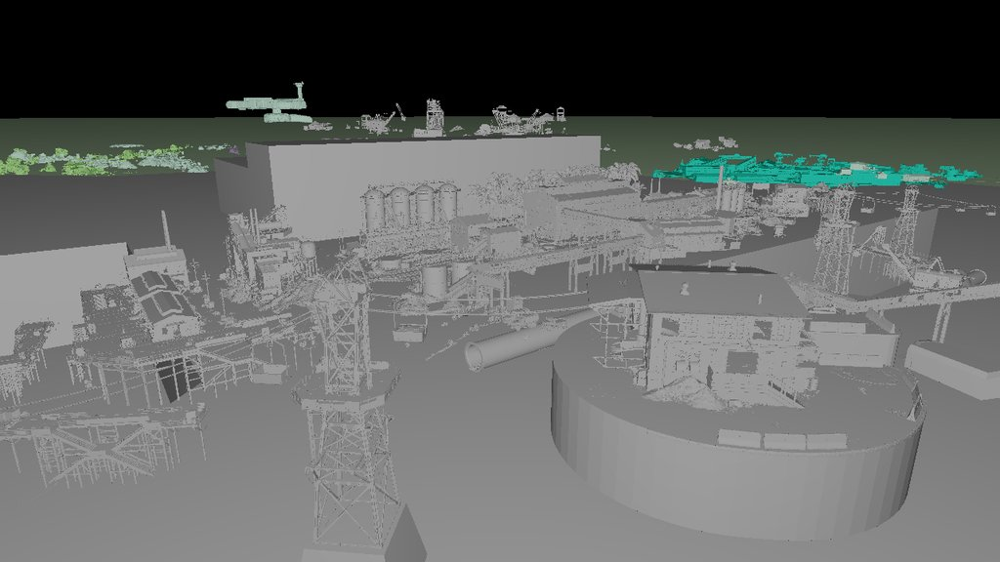 |
| `map_capital` (`map_capital_square`) | 44.3 M | 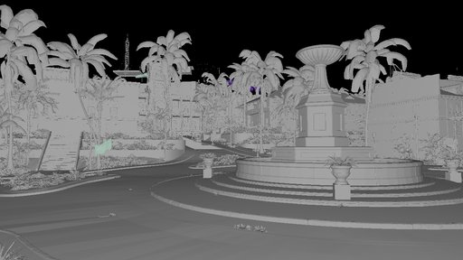 |
| `map_beachhead` (`map_beachhead_village`) | 23.6 M | 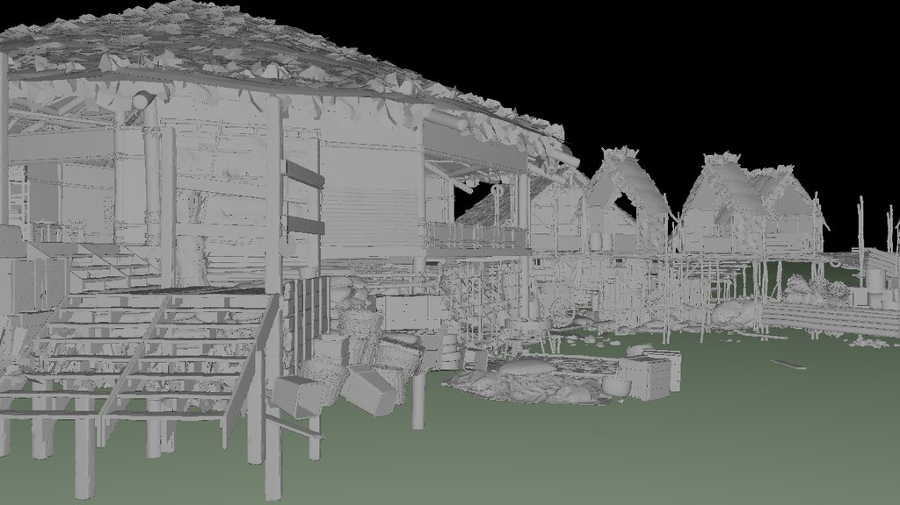 |
| `map_tile_p` (`tile_p_beach`) | 27.8 M | 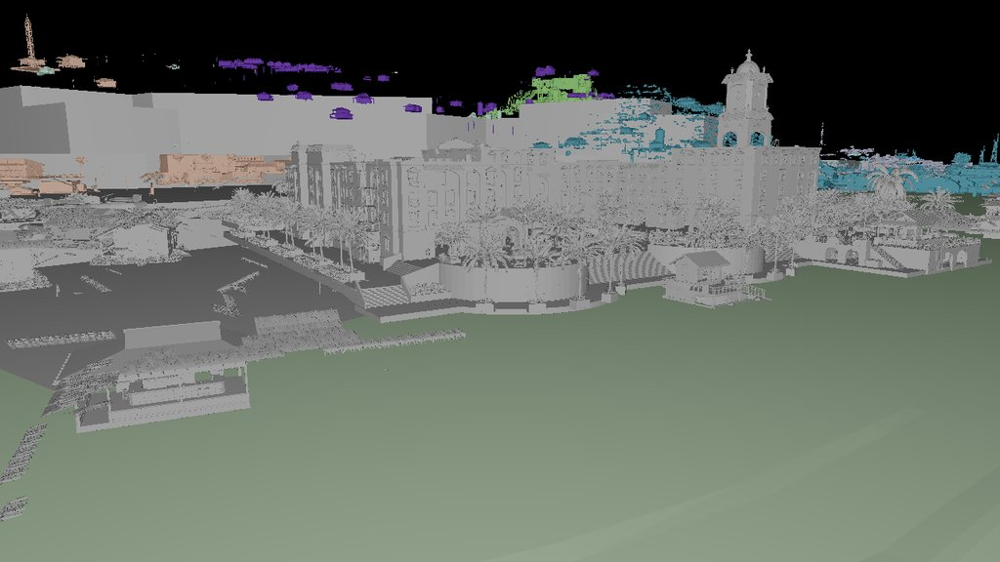 |
| `map_airfield` (`map_airfield_overview`) | 36.9 M | 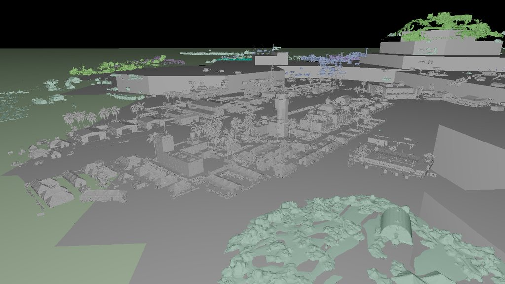 |
| `map_arsenal` (`map_arsenal_ship`) | 24.1 M | 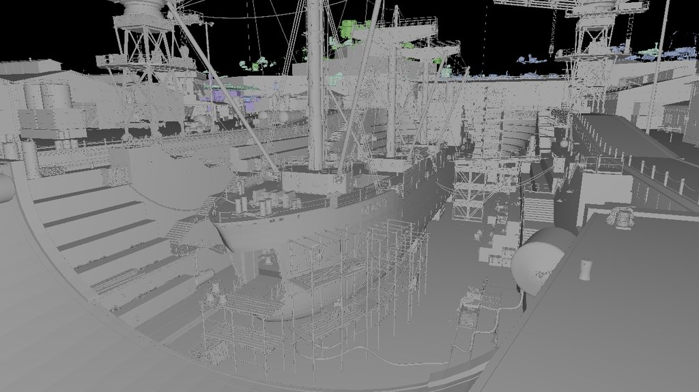 |
| `map_agricultural_center` (`map_agricultural_center_bridge`) | 18.1 M | 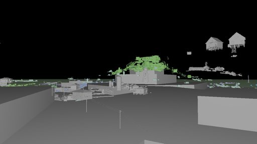 |

Every other authored camera frames one of these same districts from a different
pose — the district is promoted to `full` exactly as above, only the `-camera`
changes:

| District (camera) | Default tris @ full | View |
|---|---:|---|
| `map_phosphate_mine` (`phospate_mine_bridge`) | 29.8 M | 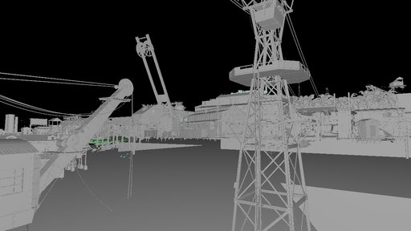 |
| `map_capital` (`map_capital_overview`) | 44.3 M | 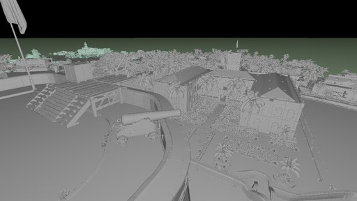 |
| `map_beachhead` (`map_beachhead_overview`) | 23.6 M | 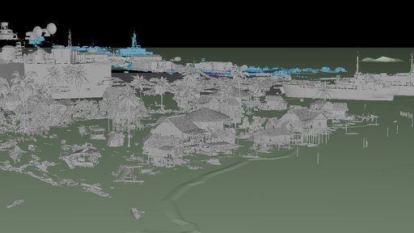 |
| `map_tile_p` (`tile_p_road`) | 27.8 M | 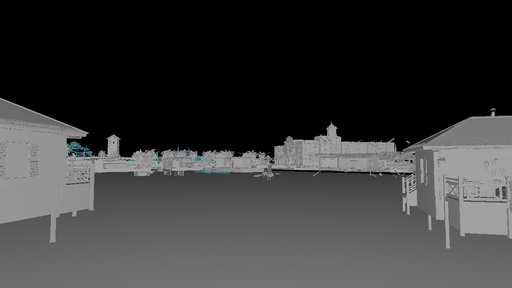 |
| `map_airfield` (`map_airfield_waiting_room`) | 36.9 M | 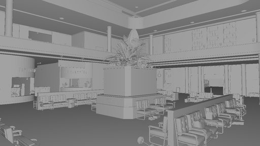 |
| `map_arsenal` (`map_arsenal_overview`) | 24.1 M | 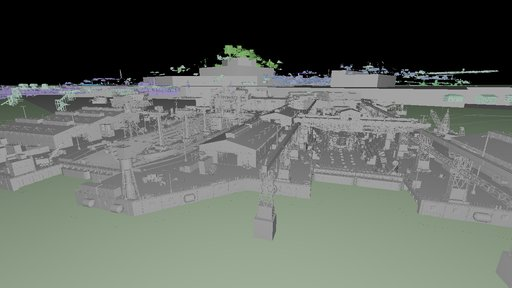 |

(1280×720 `tusdrender -rtPreview -purpose default,render,proxy` shots, downscaled
to 512 px JPEG for the repo. The colored speckles in some frames are neighboring
districts still at `proxy`, drawn with their `displayColor`. The default-tri
count is per *district*, so it is identical across that district's cameras.)

#### Per-district `tusdview --next` composition measurements

These measurements promote one district to `districtLod = "full"` in a stronger
wrapper layer and leave the other 44 districts at their authored `proxy` LOD.
The input tree is `/mnt/disk1/data/caldera` (10,496,782,370 bytes, about 10.50
GB, including all USD and texture assets). Each run used `--load-payloads`,
`--large-scene-profile caldera`, one headless Vulkan frame at time 1, and
`--timing`. `Extract` is the sum of next-core extraction/collection phases;
`Load total` is the finalize total; `Upload` and `Present` are from
`TUSDVIEW_TIME_UPLOAD=1 TUSDVIEW_TIME_FRAME=1`.

The NVIDIA RTX 5060 Ti smoke backend was unavailable during this run
(`nvidia-smi` could not communicate with the driver), so the detailed timing
pass used Vulkan llvmpipe. Composition and conversion timings remain useful;
upload/present timings are software-renderer measurements. `capital` reached
finalization but exceeded the 180 s per-run limit before GPU upload, so its
upload/present fields are intentionally blank.

| District promoted to full | Meshes | Unique/effective tris | Instances | Parse/source ms | Compose s | Extract s | Convert s | Load total s | Peak RSS MiB | Upload s | Present ms | Result |
|---|---:|---:|---:|---:|---:|---:|---:|---:|---:|---:|---:|---|
| map_agricultural_center | 1648 | 42,880,177 / 43,900,288 | 38,783 | 186.9 | 29.539 | 13.755 | 19.754 | 63.794 | 11,134 | 5.22 | 397.6 | pass |
| map_airfield | 3259 | 45,325,419 / 139,405,185 | 135,885 | 587.8 | 80.025 | 35.560 | 29.673 | 147.466 | 21,945 | 5.80 | 717.7 | pass |
| map_arsenal | 2347 | 43,621,773 / 68,327,795 | 66,493 | 361.7 | 51.887 | 22.594 | 22.034 | 97.766 | 15,931 | 5.06 | 489.6 | pass |
| map_beachhead | 2453 | 44,248,206 / 149,017,863 | 120,853 | 376.0 | 53.967 | 23.745 | 20.860 | 100.218 | 16,422 | 5.20 | 519.3 | pass |
| map_capital | 3623 | 45,498,738 / 164,146,391 | 162,769 | — | 102.006 | 43.450 | 30.525 | 178.830 | 26,134 | — | — | timeout during upload |
| map_phosphate_mine | 7719 | 45,775,280 / 108,414,347 | 90,478 | 365.9 | 50.590 | 24.133 | 17.562 | 93.693 | 15,411 | 4.74 | 634.4 | pass |
| map_tile_p | 5848 | 42,998,848 / 57,564,635 | 41,333 | 345.6 | 49.055 | 20.894 | 24.837 | 95.860 | 14,952 | 3.70 | 407.3 | pass |

The full-promotion cost is not proportional to the selected district alone:
every row still composes the complete proxy island and its shared layers. The
capital and airfield rows are the heaviest host-memory cases; the phosphate
mine has the most converted mesh nodes because its full payload is highly
fragmented. This is why per-shot full LOD remains preferable to promoting all
45 districts at once.

#### Splitting `map_capital` into smaller load units

The `map_capital` full payload is itself a 42,470-byte crate, but its composed
content contains 114 top-level children below `/world/map_capital`. Loading
that crate directly is much cheaper than composing the complete island wrapper,
but it still produces a large single conversion batch. A stronger decomposition
is to author one small wrapper per top-level child and reference the child path
inside the capital crate:

```usda
#usda 1.0
(
    upAxis = "Z"
    defaultPrim = "world"
)
def Xform "world" {
    def Xform "map_capital" {
        def Xform "cityhall_01" (
            prepend references = @.../season_4/map_capital.usd@
                </world/map_capital/cityhall_01>
        ) {}
    }
}
```

This preserves the authored world transform while allowing the viewer or a
streaming scheduler to load/convert each child independently. The following
comparison used `--next --load-payloads --large-scene-profile caldera`, one
headless Vulkan frame, and the same timing flags as the table above. The
software Vulkan backend was used because the NVIDIA driver was unavailable.

| Input decomposition | Compose s | Convert s | Load total s | Meshes | ntris | Peak RSS MiB | GPU upload s | Present ms |
|---|---:|---:|---:|---:|---:|---:|---:|---:|
| Full-island wrapper, `map_capital = full` | 102.006 | 30.525 | 178.830 | 3623 | 45,498,738 | 26,134 | — | — |
| Direct `map_capital.usd` crate | 49.396 | 41.780 | 125.879 | 3614 | 39,402,788 | 17,712 | 7.33 | 556.1 |
| One child wrapper: `cityhall_01` | 2.163 | 1.298 | 4.724 | 337 | 2,670,852 | 1,108 | 0.39 | 60.2 |

The direct crate finishes under the previous 180-second limit, but the
top-level-child split is the robust approach: each unit is small enough for
bounded conversion and can be scheduled independently. The remaining work for
production streaming is generating these child wrappers from the 114 authored
children and retaining the parent capital transform when assembling the
results.

### 2.6.3 `-lodStream`: automatic view-dependent district LOD (tusdrender)

The per-shot wrappers above pick the `full` district by hand. `tusdrender
-lodStream` does it automatically: a cheap **proxy pass** composes the scene,
scores each district by **screen-space importance**, then promotes the
top-scoring districts to `full` (via a generated wrapper layer) until a host-RSS
/ GPU-VRAM budget is hit; the rest stay `proxy`. This is the load-time form of
streamed LOD — only the selected `full` payloads get composed and made resident
— and the designed use of the `districtLod` variant.

The importance score is **projected coverage × view-alignment**:
`proxyVerts / distance² × max(0, dot(dir-to-district, camera-forward))²`. Pure
camera distance is not enough — for an *overview* camera it rewards small
gameplay overlays sitting near the eye over the dense district the shot actually
frames. Coverage adds geometric weight; the alignment term adds "what the camera
looks at". (E.g. `phospate_mine_overview`: distance ranks `map_loot_zones`
first and `map_phosphate_mine` 8th; the coverage+alignment score ranks the mine
first at `align=0.98`.)

```sh
M=/mnt/disk1/data/caldera/caldera.usda
# CPU ray tracing, default budgets (host = 50% of MemAvailable):
./build/tools/tusdrender/tusdrender $M out.png -lodStream -rtPreview \
    -camera map_capital_square -purpose default,render,proxy -w 1280 -height 720 -stats
# GPU ray query also caps by VRAM (default = 50% of the device-local heap):
./build/tools/tusdrender/tusdrender $M out.png -lodStream -vkr -camera map_capital_square ...
```

Flags: `-maxMem <GiB>` (host budget, else 50% MemAvailable), `-maxVram <GiB>`
(GPU budget, else 50% of the device-local heap — queried via a new
`lrt_vk_device_local_bytes()`), `-lodDistrictMem`/`-lodDistrictVram` (the flat
per-district cost charge; default 10 / 3 GiB), `-lodMinVerts`/`-lodMaxVerts`
(proxy-vert band; skip tiny trigger/volume children and sprawling non-district
overlays that author no `full` geometry — e.g. a 14.6 M-vert spawn-marker set
that would otherwise hijack the ranking; defaults 1000 / 2000000),
`-lodContainer` (the namespace prim whose children are districts; default
`mp_wz_island_geo`).

Measured (`phospate_mine_overview`, RTX 5060 Ti / 62 GiB host, default budgets):

```
[lodStream] budgets: host 24.7 GiB (avail 49.4, proxy 2.1)
[lodStream] 36 districts (10 sub-threshold skipped), promoting 2 to full ...
[lodStream]   FULL map_phosphate_mine score=1.67e-3 align=0.98   FULL map_tile_f align=0.92   proxy (rest) ...
```

It auto-promoted `map_phosphate_mine` (what the camera frames) + the in-view
`map_tile_f`, leaving the other 34 districts proxy. CPU peak RSS **13.7 GiB**.
Across `map_capital_square` / `phospate_mine_overview` / `map_beachhead_village`
the score always promotes the framed district first (capital, mine, beachhead
respectively). On the capital shot at default budgets, GPU built the 50 M-tri
BLAS within the 16 GiB card with VRAM the binding budget (7.96 GiB → 2
districts); CPU peak RSS there was 19.5 GiB (est 22.1 — the estimate runs
slightly high, i.e. safe).

**Cost model is intentionally simple.** Proxy geometry does not predict `full`
cost (a low-poly stand-in's vertex count is uncorrelated with the heavy geometry
behind its `full` variant — a 0.25 M-vert capital proxy explodes to 44 M `full`
tris), so the charge is a **flat per-district constant** rather than a
proxy-scaled estimate. Proxy-vert count is used only as a coarse
importance/footprint signal, and only within the `-lodMinVerts`..`-lodMaxVerts`
band — outside it lie trigger/volume prims (tiny) and sprawling non-district
overlays (e.g. the 14.6 M-vert `map_vehicle_spawns` spawn-marker set) that
author no `full` geometry and would otherwise hijack the ranking. Tune
`-lodDistrictMem` up to promote fewer districts / down to promote more.
When `-maxMem` is not set, the hard memory-abort cap is raised to 90% of
MemAvailable — *above* the 50%-of-avail selection budget — so a modest
underestimate on the heaviest district pair completes instead of aborting (the
abort cap stays an OOM safety net, not a tight selection bound). **Limitations**
(true streaming follow-ups): the selection is computed once at load (not per
frame), the chosen set is composed in a single soup/BLAS (no eviction), and the
cost charge ignores per-district size variation — so on a tight machine lower
`-lodDistrictMem` (fewer promotions) or set `-maxMem` to a higher explicit cap.

### 2.6.4 Realtime island preview: GPU-budget LOD + robust auto-framing (tusdview)

`-lodStream` (above) is a tusdrender, ray-tracing, load-time selection. The
interactive **tusdview** rasterizer hits a different wall on a fully assembled
scene. The Moana island (`/mnt/disk1/data/island`) composes via `--next` to
**83,801 draws / 42.9 M instances / 56.5 M unique tris**, and after instance
dedup the geometry itself fits comfortably in 16 GiB VRAM (instance transforms
~2.06 GiB). The problem is **draw/buffer count**: the per-mesh raster path
creates ~84 k host-visible Vulkan buffers and stalls for **7+ minutes** before
the first frame. (A plain `--next --backend vk` whole-island run times out in
the buffer-creation loop, not on memory.)

**`--max-draw-meshes N` / `--max-gpu-mem <GiB>` (GPU-budget LOD).**
`gpu_budget_lod.cc:ApplyGpuBudgetLOD()` runs once after load: it ranks meshes by
prototype size, keeps the **N most prominent** at full geometry within the count
and VRAM budgets, and **merges the entire long tail into one instanced bbox-proxy
mesh** — a unit cube instanced once per overflow instance, each instance
transform box-fitting that original prototype's object-space AABB, tinted by the
mesh's flat color. The proxy preserves instancing (so its ~2 GiB instance buffer
still fits) and per-instance frustum cullability (proxy prototype AABB is the
unit cube, transformed per instance). The scene then uploads as **~N+1 buffers**.
Simple preview only: the proxy boxes shade flat, no shadows/GI.

```sh
M=/mnt/disk1/data/island/usd/island.usda
# 40 GiB host cgroup; keep the 4000 biggest meshes full, cap full VRAM at 16 GiB,
# merge the other ~79.8 k meshes into one bbox proxy:
systemd-run --user --scope -p MemoryMax=44G -p MemorySwapMax=2G \
  ./build/tusdview --headless --next --backend vk \
    --max-tris 80000000 --max-gpu-mem 16 --max-draw-meshes 4000 \
    --frames 2 --screenshot island.ppm $M
```

```
next: 83801 draws, 42869753 instances, 56553204 unique tris, instXform VRAM ~2.06 GB
gpu-budget LOD: 4000 meshes full (0.08 GiB), merged 79801 meshes / 42730328
                instances into bbox proxy (now 4001 draws)
render stats: 4001/4001 meshes visible, 42869757 instances, 581550424 drawn tris, 4001 draw calls
```

**`--no-robust-frame` (robust auto-framing, on by default).** The island's *raw*
scene bbox is **170,091 units across** — a handful of far-flung meshes sit at
±tens of thousands while the actual island occupies a ~9,200-unit region near the
origin. `fitToScene` on the raw bbox renders the island as a sub-pixel speck.
`ComputeRobustSceneBounds()` fixes the framing with **mass-weighted endpoint
trimming**: each mesh's world-AABB min/max endpoints carry its geometry mass
(`instanceCount × triCount`), and per axis 1% of the *mass* is trimmed from each
tail. Sparse far elements weigh ~nothing and drop out; the dense island defines
the kept range. It only overrides framing when the result is materially tighter
(robust diag < 70% of full), so normal scenes that fill their bbox are
untouched. It is computed from the full per-mesh set **before** the LOD merge
(post-merge the proxy's 42 M instances would swamp the weighting) and cached.
The named-USD-camera path (`--camera`) is unaffected.

```
robust auto-frame: trimmed 1% outliers, scene diag 170091.6 -> 9265.6 (95% smaller)
```

With both on, the whole island uploads in seconds instead of stalling, fits well
under 16 GiB VRAM, renders all 42.9 M instances through the existing per-instance
frustum culling, and frames Motunui (shoreline, palms as full trunks + bbox-proxy
foliage) instead of a speck. **Limitations:** the proxy is rebuilt only on load
(not per frame / per view), it is a flat-shaded box soup (no materials/textures
on the merged tail), and the full-mesh set is chosen by prototype size, not
screen-space importance — a per-view promotion pass (à la `-lodStream`) is the
follow-up.

### 2.6.5 Per-frame view-dependent raster LOD (`--raster-lod`, tusdview)

§2.6.4's GPU-budget LOD is a **load-time** decision: it bounds upload/VRAM by
fixing one full/proxy split for the whole session. `--raster-lod` is the
**per-frame, view-dependent** follow-up it called for. It runs inside the
existing raster instance cull (`compactMeshInstances`, shared by the sync,
headless, and async-worker cull paths), so it composes with — and is independent
of — the load-time merge.

For every instance that passes the frustum cull, the cull classifies it by its
**projected screen radius** (`ProjectedRadiusPx` = `focalPx · worldRadius /
viewDepth`, from the instance's world-AABB):

- `px < --raster-lod-cull-px` (default `1.5`) → **dropped** (sub-pixel).
- `px < --raster-lod-full-px` (default `48`) → **collapsed to a shared unit-box
  proxy** (box-fit onto the instance's world AABB via `BoxFitXform`, tinted by
  the instance color), accumulated across all prototypes into one instanced draw.
- otherwise → drawn **full-detail**.

Box proxies render on both raster backends: GL (`initBoxProxy`) and Vulkan
(`initBoxProxyRaster` / `drawBoxProxies`, reusing the prototype instanced
pipeline — meshId `-1`, geometric-normal shading). This matters for the headless
path specifically: **headless forces the Vulkan backend**, so on island/Caldera
captures the VK box proxies are what keep the distant scene visible. The feature
is **off by default** and the LOD-off path is byte-identical (verified MAE 0 on
both backends). The cull itself is accelerated by a coarse per-prototype spatial
grid (`BuildRtLodGrid`) that frustum-rejects whole cells before the per-instance
loop.

```sh
M=/mnt/disk1/data/island/usd/island.usda
# Whole island, VK raster, robust auto-frame; collapse anything under 48 px to a
# box, drop anything under 1 px:
systemd-run --user --scope -p MemoryMax=44G -p MemorySwapMax=2G \
  ./build/tusdview --headless --next --backend vk \
    --raster-lod --raster-lod-cull-px 1 --raster-lod-full-px 48 \
    --max-tris 80000000 --frames 4 --screenshot island.ppm $M
```

Measured on the RTX 5060 Ti (whole island, 42.9 M instances, VK raster, robust
auto-frame, 4 frames so the focal length settles — see note below):

| Mode | Full-detail instances | `present` (GPU+readback) | Distant scene |
|------|----------------------|--------------------------|---------------|
| `--raster-lod` off | 23.7 M visible | ~5620 ms | full |
| size-cull only (`--raster-lod-cull-px 4`, no proxy) | 69 k | ~555 ms | **dropped** |
| box proxies (`--raster-lod-cull-px 1 --raster-lod-full-px 48`) | 15 + box soup | ~480–610 ms | **kept as boxes** |

So size-culling alone cuts visible instances ~340× (23.7 M → 69 k) and the GPU
present ~10× (5.6 s → 0.56 s); switching the drop to a box proxy keeps the same
~10× frame-time win **without** losing the distant island — the far vegetation
clumps become cheap gray boxes (~12 tris each) instead of vanishing. Unlike
§2.6.4's merge this re-selects every time the camera settles, so pulling the
camera in promotes near boxes back to full geometry.

> **Note on focal length.** The viewport height / aspect are not final until
> after the first `resizeViewport`, so frame 1's projected-radius math uses a
> stale focal length and the cull re-runs on frame 2. Use `--frames ≥ 4` for
> headless LOD captures so the final frame reflects the settled camera.

This is a per-frame raster analogue of the RT path's view-dependent LOD
(`rt_lod.{hh,cc}`, §2.6.3-adjacent), sharing the same `ProjectedRadiusPx` /
`BoxFitXform` math (`lod_math.hh`). **Limitations:** hard switch at `full-px`
(no stochastic crossfade band — the raster path has no accumulator to resolve a
dither), box proxies are flat-shaded (no materials/textures), and `full-px` is a
single global threshold rather than a per-prototype importance score.

### 2.6.6 Realtime large-scene profiles (`--large-scene-profile`, tusdview)

`tusdview --large-scene-profile off|auto|caldera|island|alab` is a preset layer
over the existing Vulkan large-scene flags. It is meant for repeatable Caldera,
Island, and ALab smoke/performance runs without memorizing the full flag list:
profiles enable `--next`, prefer the Vulkan backend, enable raster/RT LOD, set
conservative draw/VRAM budgets, and print the resolved settings at startup.
`auto` only applies a profile when the input path clearly names Caldera, Island
or Moana, or ALab; otherwise it resolves to `off`.

Explicit CLI flags win. For example, `--large-scene-profile island
--max-gpu-mem 6 --raster-lod-full-px 32` keeps the Island preset but uses the
user's GPU budget and LOD threshold. Profiles do **not** enable texture resize or
BCn/compressed texture paths; those remain controlled only by
`--texture-max-size`, `--texture-budget-mb`, and `--texture-compress`.

Scene-specific defaults:

- `caldera`: raises the triangle cap to avoid the old 30 M-triangle truncation,
  uses the named overview camera when no camera is passed, and enables district
  LOD streaming with host/VRAM budgets.
- `island`: caps full raster uploads by draw count and VRAM, then relies on
  per-frame raster LOD to keep the distant island visible as box proxies.
- `alab`: enables parent-relative composition paths because the public ALab
  layout uses `../lightingrenderovers/`, then applies the same Vulkan/LOD budget
  preset pattern.

Optional local harness:

```sh
TUSDVIEW=./build_ninja/tusdview \
CALDERA=/path/to/caldera.usda \
ISLAND=/path/to/island.usda \
ALAB=/path/to/alab.usda \
  bash examples/tusdview/tests/run-large-scene-profiles.sh

TUSDRENDER=./build_ninja/tools/tusdrender/tusdrender \
CALDERA=/path/to/caldera.usda \
ISLAND=/path/to/island.usda \
ALAB=/path/to/alab.usda \
  bash tools/tusdrender/tests/run-large-scene-profiles.sh
```

The harnesses skip scenes whose environment variables are unset, write one image
and one log per scene, and check that the resolved profile settings appeared in
the log. Each writes `summary.tsv` under `OUT_DIR` with profile, asset, exit
code, elapsed seconds, image bytes, and log path. Use `TUSDVIEW_EXTRA_ARGS` or
`TUSDRENDER_EXTRA_ARGS` to add per-run flags such as `--rt`, `--mode albedo`,
`-stats`, or `-gpuShade preview`. `TUSDVIEW_SCENE_TIMEOUT` defaults to `10m` and
bounds each viewer scene run. They are intentionally not required ctests because
these large assets are not tracked in the repository.

### 2.6.7 Ray-traced full island (tusdview `--hip`, AMD RX 9070 XT)

§2.6.4 is a *rasterizer* preview: it merges the long tail into a flat box-proxy so
the per-mesh draw path stays cheap. The **HIP ray tracer** (`--hip`) takes the
opposite approach — it ignores the raster draw/buffer budget entirely and traces
the **full** geometry: every prototype's real triangles, instanced by the real
per-instance transforms, in one 2-level BVH (per-prototype BLAS + a TLAS over all
instances). On a 16 GiB GPU the **whole Moana island fits** — all 42.9 M instances
over 30.0 M unique triangles (≈17.5 B effective), no LOD, no proxy.

```sh
M=/mnt/disk1/data/island/usd/island.usda
# Full island, HIP ray tracing, framed on the hero shot camera.
# --max-instances 0 = unlimited (the 16 M default truncates by mesh order).
./build/tusdview --headless --next --hip \
  --camera shotCam --max-instances 0 --rt-samples 2 \
  --frames 4 --screenshot island.ppm $M
```

```
next: 83798 draws, 42869753 instances, 30009608 unique tris (17508653596 effective), instXform VRAM ~2.06 GB, up=Y
[rt_scene_build] 83798 meshes -> 30009608 tris / 42869754 instances: phaseA(geom) 28518 ms, phaseB(assemble+TLAS) 56137 ms
HIP: traced 42869754 instances, 30009608 unique tris, 91138 colors -> island.ppm
```

Measured on the RX 9070 XT (gfx1201, 16 GiB): **2 m 03 s** wall-clock end-to-end,
**~28.7 GiB host RSS** during the CPU scene build, and the device acceleration
structure fits under 16 GiB VRAM (no OOM). The result is the iconic Motunui
shoreline — mossy coral-rock boulders in the foreground, sandy beach, the line of
bare ironwood trees.

Notes and gotchas:

- **`--next` is mandatory.** The standard Tydra loader rejects the island's
  `..`-relative payloads (same "Unsafe asset path" as Caldera, §2.6.1); `--next`
  composes them. `--hip` then traces whatever geometry the loader produced — it
  does **not** apply the §2.6.4 raster box-proxy LOD.
- **`--max-instances 0`.** The ray tracer defaults to a 16 M instance cap; the
  island has 42.9 M, so the default **truncates by mesh build order** (not frustum
  visibility) and drops most of the scene. Pass `0` for the full island.
- **Named cameras.** `island.usda` authors `shotCam`, `birdseyeCam`, `beachCam`,
  `dunesACam`, `grassCam`, `palmsCam`, `rootsCam`; select one with `--camera`
  (a name that doesn't match silently falls back to whole-scene auto-fit, which
  for the island is a speck — see §2.6.4's robust framing). `--rt-samples N` adds
  Halton(2,3) sub-pixel AA.
- **What makes it feasible.** Two earlier fixes: (1) the CPU scene build is
  parallelized (`rt_scene_build.cc` — per-mesh geometry, per-instance transforms,
  and TLAS all run multithreaded; byte-identical to the serial path); and (2) for
  a headless `--hip` screenshot tusdview **skips the rasterizer's `uploadScene` /
  per-frame `renderViewportScene`** (`rtOwnsScreenshot_`), which would otherwise
  spend minutes culling 42.9 M instances for a frame that is immediately
  discarded. Set `TUSDVIEW_RT_TIMING=1` to print the `[rt_scene_build]` phase
  breakdown and the retained host residency split (geometry, BVH/instances,
  analytic points, materials, textures, and volumes).

### 2.7 RenderScene optimization for realtime viewers

Payload deferral solves structural loading, but realtime web/native viewers have
a second pressure point after composition: authored scenes can expand to thousands
of duplicate materials, many equivalent texture records, thousands of draw-call
mesh nodes, and tens of thousands of transform-only prim nodes. TinyUSDZ now has
opt-in `RenderSceneConverterConfig` switches for this viewer-oriented path:

| Option | Default | Effect |
|---|---:|---|
| `dedup_materials_by_texture_identity` | `false` | Deduplicate equivalent render materials by full shader parameters and canonical texture identity. Also enables a source-graph signature cache so duplicate source materials can reuse an existing render material ID before full conversion. |
| `merge_meshes` | `false` | Merge compatible meshes sharing a material to reduce draw calls. |
| `merge_meshes_bake_transform` | `true` | Bake mesh node world transforms into vertex data while merging so meshes under different transforms can still aggregate. |
| `flatten_optimized_render_tree` | `false` | Replace the authored prim hierarchy with a compact render-only root containing renderable meshes/lights/cameras in world space. This intentionally breaks prim-tree fidelity. |

All destructive optimizations are disabled by default. Existing conversion paths
therefore preserve the authored prim tree and one-render-material-per-converted
source material unless an app explicitly opts into the viewer path.

The material optimization has two stages:

1. A conservative source-graph signature cache compares authored Material /
   Shader / NodeGraph payloads with local material paths normalized. A cache hit
   reuses the canonical render material ID and skips full material conversion.
2. A post-conversion material/texture compaction pass remaps mesh material IDs,
   material subset IDs, instance material IDs, and shader texture IDs to
   canonical render objects. Texture identity uses resolved image ID, wrapping,
   UDIM linkage/remap, scale/bias, output channel, UV primvar, and transform.

Mesh merging is applied after material/texture compaction. It only merges meshes
that are safe for render aggregation: no skeletal skinning, no blend-shape
targets, no per-face material subset map, and compatible vertex attribute
layouts. When transform baking is enabled, packed direction attributes that
cannot be transformed as float3 are dropped from the merged mesh so consumers can
recompute them rather than reading corrupted normals/tangents.

Flattened render tree mode is separate from mesh merging. It keeps renderable
nodes only and assigns each kept node its previous world matrix as its new local
matrix under a synthetic root. This substantially reduces JS/renderer object
construction overhead in viewer-only workflows, but it should not be used by
tools that need authored prim paths, hierarchy editing, or exact selection
round-tripping.

The web MaterialX demo exposes the same switches as URL/query/UI settings:

```
nativeMaterialDedup=true
nativeMeshMerge=true
nativeMeshMergeBakeTransform=true
nativeFlattenRenderTree=true
meshAggregation=off|material
```

On a representative flattened large scene with resized PNG textures, the fully
native viewer path reduced render mesh nodes from a few thousand to a few
hundred, compacted the JS node tree from tens of thousands of nodes to hundreds,
kept the final material count stable, and reduced Three.js construction from
roughly a second to a few hundred milliseconds. Source-material signature caching
also reduced native material conversion from roughly second-scale to
double-digit milliseconds in that workload. Treat these as shape-of-improvement
numbers rather than a portable benchmark; exact results depend on material
duplication, mesh compatibility, and hierarchy depth.

---

### 2.8 Validated VRAM-fit configs: Island + Caldera on 6 GiB / 15 GiB (2026-07)

GPU-backend review outcome (NVIDIA RTX 5060 Ti 16 GiB, driver-reported
15.57 GiB device-local budget). Every row below was measured with
`benchmark/tusdrender/bench_vram.sh` (true VRAM: `nvidia-smi` 100 ms peak polling minus
idle baseline — earlier "VRAM" numbers in this doc that came from RSS are
host RAM, not VRAM). The **6 GiB rows additionally completed unchanged under
a 10 GiB VRAM ballast** (`benchmark/tusdrender/vram_ballast.py 10`), i.e. with only
~5.5 GiB of the card actually available. Cameras: island `shotCam`, caldera
`phospate_mine_overview`. tusdview headless default 1469×1284; tusdrender
1280×720.

Perf/VRAM changes this round (all image-neutral — byte-identical or
pass the cross-backend tolerance test):

- **LightRT VK BLAS compaction** (default ON, `LRT_VK_BLAS_COMPACT=0` opts
  out): caldera `-vkInstanced` 1051→525 MiB; island full instance set
  7153→5408 MiB **and** 49.6→31.7 s (the compaction rebuild batches BLAS
  builds in ≤512-proto waves — two submits per wave instead of one per
  prototype).
- **tusdview Caldera `--rt` fixed** (purpose-filtered TLAS, see §2.6.1):
  BLAS build 1907→901 ms, RT VRAM 2.73→1.23 GiB, mine district now traces.
- **tusdview device-local MDI instance mirror** (auto when
  VK_EXT_memory_budget shows ≥20 % headroom; `TUSDVIEW_MDI_DEVLOCAL=0/1`
  forces): island no-LOD 843→766 ms/frame. No effect with `--raster-lod`
  (that frame is primitive-bound: 55 M drawn tris of non-instanced unique
  geometry, 63 visible instances). Costs 1.37 GB VRAM on island — the auto
  headroom check keeps it off in tight-VRAM situations.
- **tusdrender flat GPU paths**: `-vkr` skips the unused CPU BVH (15.4→6.6 s
  on caldera), `-vk` builds it threaded (15.2→8.5 s); shade/write is
  row-parallel; `-stats` prints per-stage `[gpu-stats]` timings.
- **CUDA/HIP `--rt-samples`**: device-side accumulation, one readback at the
  end (was one `cuMemcpyDtoH` + host byte-loop per sample).
- Live VRAM: tusdview logs `vram=used/budget GiB` in `[present]`/`[vk_rt]`
  lines (VK_EXT_memory_budget).

**tusdview** (`T=./build/tusdview`, `ISL=/mnt/disk1/data/island/usd/island.usda`,
`CAL=/mnt/disk1/data/caldera/caldera.usda`):

| Config | Recipe | VRAM peak | Steady frame | Fits |
|---|---|---|---|---|
| Island raster, 15 GiB | `--next --camera shotCam` (mirror auto-on) | 1.55 GiB | 766 ms | 15 GiB |
| Island raster, 6 GiB | `--next --camera shotCam --max-gpu-mem 4 --raster-lod --raster-lod-full-px 32 --raster-lod-cull-px 3` + `TUSDVIEW_MDI_DEVLOCAL=0` | 0.25 GiB | ~362 ms | both |
| Island RT, 15 GiB | `--next --rt --rt-lod --rt-lod-full-px 96 --rt-lod-cull-px 1 --camera shotCam` | 4.29 GiB | — | both |
| Island RT, 6 GiB | `--next --rt --rt-lod --rt-lod-full-px 48 --rt-lod-cull-px 3 --camera shotCam` | 4.19 GiB | — | both (ballast-verified) |
| Caldera raster | `--next --camera phospate_mine_overview --max-tris 40000000` | 0.18 GiB | — | both |
| Caldera RT | raster recipe + `--rt` | 1.40 GiB | — | both (ballast-verified) |
| Caldera CUDA, 15 GiB | raster recipe + `--cuda` | 7.48 GiB | — | 15 GiB only |
| Caldera CUDA, 6 GiB | `--cuda --max-tris 8000000` | 1.98 GiB | — | both (ballast-verified) |
| Island CUDA | `--next --cuda --camera shotCam` | 2.39 GiB | — | both (ballast-verified) |

Notes: the island RT rt-lod px knobs barely move VRAM (4.19 vs 4.29 GiB —
the grid + LOD-bound BLAS set is the resident cost); both fit 6 GiB but with
little margin — the P2 tusdview BLAS-compaction port is the next lever. The
caldera CUDA cliff between `--max-tris 13000000` (5.53 GiB, marginal) and
`8000000` (1.98 GiB) is one huge district mesh crossing the cap; the 8 M cap
renders the same visible content at this camera (identical image stats).

**tusdrender** (`B=./build/tools/tusdrender/tusdrender`):

| Config | Recipe | VRAM peak | Wall | Fits |
|---|---|---|---|---|
| Island full set, 15 GiB | `TUSDR_INST_BUDGET=45000000 $B $ISL out.png -vkInstanced -camera shotCam -w 1280 -height 720 -maxMem 24` | 5.41 GiB | 31.7 s | 15 GiB (6 GiB too marginal) |
| Island, 6 GiB | `TUSDR_INST_BUDGET=16777216 LRT_VK_TLAS_SLICE=8388608 $B $ISL out.png -vkInstanced -rtLod -rtLodFullPx 48 -rtLodCullPx 3 -camera shotCam -w 1280 -height 720 -maxMem 14` | 0.40 GiB | 19.3 s | both (ballast-verified) |
| Caldera | `$B $CAL out.png -vkInstanced -camera phospate_mine_overview -w 1280 -height 720 -maxMem 14` | 0.52 GiB | 5.8 s | both (ballast-verified) |

Avoid flat `-vkr` on caldera when `-vkInstanced` works (0.95 vs 0.52 GiB);
its win this round is speed (6.6 s total after the CPU-BVH skip). The island
full-set row is the compaction headline: 42.8 M instances now render in
5.41 GiB VRAM (uncompacted: 7.15 GiB) — it even *passes* the nominal
5.5 GiB bar, but leaves no margin for a real desktop, so it is listed as the
15 GiB config.

**Remaining follow-ons (P2, unimplemented):** device-local node/block buffers for
the `-vk` compute path; tiled ray/hit dispatch; TLAS `PREFER_FAST_BUILD` for
settle rebuilds; a `--vram-budget <GiB>` umbrella flag for **tusdrender**
(tusdview has it: `examples/tusdview/main.cc` — the one number the whole budget
tree descends from); raster LOD for *non-instanced* meshes (the island
`--raster-lod` frame is bound by 55 M non-instanced drawn tris — the instanced
side is already solved). The two headline follow-ons from the 2026-07 round are
now done: the **tusdview BLAS-compaction port** (`TUSDVIEW_BLAS_COMPACT`,
`examples/tusdview/vk/vk_renderer.cc`), and the island RT 4.2 → est. ~2.7 GiB
saving it was expected to deliver.

### 2.9 Host-memory matrix: weld ratio + texture cap (`--next`, 2026-07-11)

Companion to §2.8, measuring a different thing: these are **host peak RSS**
(`/usr/bin/time -v`, so process startup is included), not device VRAM. They
exist to catch two `--next` regressions no unit test can see — a weld key that
over-splits (the memory win silently evaporates) and a texture cap that stops
bounding decode. Xvfb + NVIDIA RTX 5060 Ti.

Deferred-payload profiles (`examples/tusdview/tests/run-large-scene-profiles.sh`,
all three PASS). Each resolves `backend=vk --next=on --raster-lod=on --rt-lod=on
--max-gpu-mem=8.0` — the 8 GiB is `ComputeResourceBudget`'s half-of-16-GiB, not
a hardcode:

| Scene | Peak RSS | Prior baseline | Wall |
|---|---|---|---|
| Island | 0.45 GB | 0.49 GB | 2.9 s |
| Caldera | 2.06 GB | 2.18 GB | 6.5 s |
| ALab | 0.52 GB | 0.55 GB | 3.0 s |

**These profiles defer payloads and therefore decode 0 textures** — they do not
exercise the texture cap, and their weld ratios cover only the proxy geometry.
Add `--load-payloads` for the runs that do:

| Scene | Weld ratio | Textures | Wall | Peak RSS |
|---|---|---|---|---|
| Island | **1.04x** (21 159 184 verts / 20 437 898 points) | 0 | 72 s | 18.7 GB |
| Caldera | **1.48x** (31 905 889 / 21 547 797) | 0 | 32 s | 10.8 GB |
| ALab | **1.29x** (6 726 046 / 5 193 895) | 343, 1372 MB decoded (budget 1920 MB, **0 downscaled**) | 17 s | 5.3 GB |

The weld ratio is the number to watch: a ratio drifting toward the
corners-per-point count (~4-6x) means the weld key is too strict and the
deduplication is gone. Island composes 40.9 M instances / 11.7 G effective tris
in this configuration and still fits the 30 GiB host headroom.

```bash
CALDERA=/mnt/disk1/data/caldera/caldera.usda \
ISLAND=/mnt/disk1/data/island/usd/island.usda \
ALAB=/mnt/disk1/data/alab/_merged_ALab/entry.usda \
  bash examples/tusdview/tests/run-large-scene-profiles.sh

# The full-payload run (weld + texture cap), per scene:
/usr/bin/time -v ./build/tusdview --headless --large-scene-profile alab \
  --load-payloads --frames 1 --screenshot alab.ppm \
  /mnt/disk1/data/alab/_merged_ALab/entry.usda
# watch: 'next: weld N vertices from M points (Kx)'
#        'next: textures N, decoded X MB (cap ..., budget ..., K downscaled)'
```

---

### 2.10 Raster LOD reaches non-instanced geometry (2026-07-11)

`--raster-lod` classified only instanced prototypes, so Island's unique geometry
was drawn in full no matter how small it was on screen. It now runs the same
Cull / Proxy / Full classification over non-instanced meshes.

The prerequisite was a loader bug: the `--next` static-batch path copied the
running **scene**-bounds accumulator into every batch as its AABB, so no unique
mesh could ever be outside the frustum or small on screen — the per-mesh frustum
cull was a no-op too. Each batch now carries its own world bounds (skinned
batches keep the conservative scene box, since their vertices are a single pose).

| Island, `--next`, 1456×1264 headless | drawn tris | meshes drawn |
|---|---|---|
| `--raster-lod` off | 21 646 M (43.2 M instances) | 100 801 / 100 801 |
| `--raster-lod` on, before | 40.3 M | 100 801 / 100 801 |
| `--raster-lod` on, after | **15.2 M** | 84 400 / 100 801 |

Regression test: `tusdview-noninstanced-lod`.

### 2.11 tusdrender `-vk` compute trace: ray tiling, and the device-local BVH
that did not pay (2026-07-11)

`lrt_vk_trace_scene` allocated the whole frame's rays and hits up front —
48 B × w × h × spp, i.e. **6.3 GB of VRAM for 1920×1080 at 64 spp**, on top of
the BVH — and dispatched them as one job. It now traces in fixed tiles
(`LRT_VK_RAY_TILE`, default 4 M rays = a 192 MiB working set). Rays are
independent, so this is exactly image-neutral, and it is also *faster*:

| Suzanne, 1024×1024 × 32 spp (33.5 M rays), RTX 5060 Ti | trace | ray+hit VRAM |
|---|---|---|
| one whole-frame dispatch | 3.61 s | ~1.6 GiB |
| tiled, 4 M rays | **2.83 s** | **192 MiB** |

Device-local node/block buffers (`LRT_VK_DEVICE_LOCAL=1`) were the other half of
the §2.8 plan, and they do **not** pay off — left implemented but off by default.
Measured on ALab (29.2 M tris; 297 MiB nodes + 1.6 GiB blocks, verified resident
in VRAM):

| | per-ray trace | 16.7 M-ray trace |
|---|---|---|
| host-visible BVH | 0.144 µs | 4.65 s |
| device-local BVH | 0.144 µs | 4.92 s (the staging copy) |

Traversal is simply not bound by where the BVH lives on this GPU, and moving it
into VRAM spends ~1.9 GiB of the budget this work exists to reclaim. The
reasoning still holds for a GPU whose traversal *is* bandwidth-bound, hence the
flag — but measure before enabling it.

Regression test: `tool-tusdrender-vk-ray-tiling` (4 tiles must be byte-identical
to one whole-frame dispatch).

### 2.12 TLAS `PREFER_FAST_BUILD`: measured, rejected (2026-07-12)

The last item of the §2.8 list, and it does not pay. On Island (`--rt --rt-lod`,
36 k TLAS instances) the TLAS acceleration-structure build is **0.7–4.6 ms of a
600–8400 ms rebuild** — the rebuild is dominated by the BLAS builds and the
instance array, not the TLAS. `PREFER_FAST_BUILD` would save ~1 ms of a rebuild
that only happens when the camera settles, and charge for it on every
accumulation frame afterwards.

Left as a lever (`TUSDVIEW_TLAS_FAST_BUILD=1`) for a GPU or scene where the
balance differs. `TUSDVIEW_RT_TIMING=1` now prints the AS-build time on its own
line, so the trade can be re-measured rather than re-argued.

---

## 3. Roadmap (remaining implementation)

The loader bounds memory and streams payloads. Cross-directory cwp anchoring
(§3.1) and referenced-prim descendant reconstruction (§3.2) are now **fixed** —
Caldera composes its full proxy-mode structure (32,811 prims, geometry deferred)
in ~1.7 GiB. The items below are remaining enhancements.

### 3.1 Cross-directory cwp anchoring — FIXED

**Was:** a loaded layer's PrimSpecs got their working-path stamped from
`GetBaseDir(authored_asset_path)` — a *relative* path — instead of the *resolved
absolute* base directory, so nested references lost their parent-directory
context (e.g. `prefabs/...` inside `map_source/mp_wz_island_geo.usd` anchored to
the scene root instead of `map_source/`). A second case: when sublayer
flattening merged a stronger `over` (carrying the root layer's cwp) onto a weaker
`def` that authored the reference (e.g. Caldera's root `over mp_wz_island_paths`
over `mp_wz_island.usd`'s `def`), the merged prim kept the root cwp and
mis-anchored the arc.

**Fix (implemented):**
- Pass the **resolved** path (not the authored relative path) to
  `LoadLayerFromMemory` at every composition load site, so a loaded layer's
  prims are stamped with their resolved directory: `LoadAsset`
  (`src/composition.cc`), `DefaultLoadAndOwnLayer` (`src/composition-graph.cc`),
  and `pcp::LayerRegistry::GetOrLoad` (`src/pcp/layer-registry.cc`).
- In sublayer merge (`CombinePrimSpecRec`, `src/composition.cc`), when a stronger
  `over` absorbs a weaker `def`/`class`, adopt the **defining** layer's
  asset-resolution anchor (cwp + search paths) so reference/payload arcs authored
  in the defining layer resolve against the correct directory.

Regression test: `tests/feat/large-scene/` (`feat-large-scene`) uses a
filename-collision fixture (a malformed decoy `leaf.usda` in the root dir vs. the
real one in `sub/`) so the parse-once registry's parse count only goes non-zero
when the reference anchors to the correct directory — it fails if either fix is
reverted. Full unit suite (853 cases) unaffected.

### 3.2 Referenced-prim descendant reconstruction — FIXED

**Was:** `CompositionGraph` built a `PrimIndex` per prim by walking only the
**root-layer** namespace (`BuildPrimIndex` DFS over the root-layer PrimSpec's
children) and `ScanArcsAndEnqueueTasks` scanned only a prim's *own* arcs. Child
prims introduced *by a reference* (e.g. `paths.usd`'s `mp_wz_island_geo`, which
itself references `geo.usd`) were never added to the namespace, so their arcs
were never followed and they never reached the Stage. Caldera's chain
(`mp_wz_island` → `paths` → `geo` → prefabs → proxy payloads) stopped a few
levels in (≈6 files parsed, 0 deferred payloads).

**Fix (implemented, `src/composition-graph.cc`):** `BuildPrimIndex` now expands
the **composed** namespace. After building a prim's index it gathers the union
of child names across *all* of the index's nodes (`GatherComposedChildNames`),
and builds each child's index by **descending every node of the parent index one
namespace level** (`PrimIndexBuilder::BuildChildFrom` / `SeedDescendedNodes`):
each descended node keeps its parent's arc type / layer stack / strength so the
child inherits the parent's reference & payload arcs, and the descended prims'
own arcs are then scanned and followed (which pulls nested references such as
`geo.usd`). This reconstructs referenced descendants *and* follows their nested
arcs, recursively.

**Result:** Caldera (proxy, LoadNone) composes **32,811 prims / 122 files / 373
deferred payloads** in **~1.7 GiB / ~3 s** — the full structural composition,
geometry deferred. Regression test `feat-large-scene` asserts a referenced
prim's grandchild (`/P/M`) is reconstructed. Full unit suite (853) unaffected.

`pcp::Cache::BuildStage` now mirrors this namespace expansion for stage
reconstruction: it starts from cached root PrimIndices, descends each composed
parent index with `PrimIndexBuilder::BuildChildFrom`, and composes temporary
child indices for referenced descendants. Lazy `ComputePrimIndex()` remains
local to explicitly requested prim paths, but full-stage reconstruction now
matches the eager engine for referenced grandchildren. Regression:
`pcp_buildstage_reference_grandchildren_test`. Deferred PCP payload streaming now
also reprocesses the newly loaded payload node, so references/payloads authored
inside a streamed payload layer are visible immediately after `LoadPayload`.
Regression: `pcp_external_payload_load_reprocesses_nested_arcs_test`.

### 3.3 mmap-through-composition / fd bounds

mmap zero-copy (`USDLoadOptions::mmap_zero_copy`) defers large uncompressed
float arrays to disk on the legacy direct-Stage reader. Full composed-layer mmap
is now supported through the **next PCP backend**
(`TINYUSDZ_USE_NEXT_PCP_LARGE_SCENE=ON`): every file-backed USDC layer is read
with lazy arrays and mmap enabled, each `LazyArrayRef` retains shared ownership
of its own `CrateDataSource`, and that reference survives Layer → composed
PrimSpec → rebuilt Stage copies without materialization. This naturally handles
many sublayers/references/payload files rather than relying on a single global
mmap table. `LargeSceneLoadOptions::mmap_zero_copy` controls both lazy arrays and
mmap for the whole next-PCP load (default ON); disabling it produces the same
composed result with eagerly decoded, owned array values.

The legacy CompositionGraph backend deliberately stays in copy mode for
composed layers: its `Stage` mmap table addresses one source buffer and cannot
identify per-layer sources. Extending that representation would duplicate the
shared-source ownership already provided by next PCP. Direct legacy
`LoadUSDCFromFile(..., mmap_zero_copy=true)` remains supported for one-file
Stages.

The descriptor-bound part is now implemented: `AssetResolutionResolver` tracks a
per-resolver concurrent open file-descriptor / asset-handle budget
(`max_file_descriptors`, default **1024**). `LargeSceneLoadOptions` forwards this
limit into sublayer/reference/payload loading. `open_asset()` reports a hard
error when the budget is reached instead of falling through to an OS-level
`EMFILE` failure, and the composition graph treats that specific resolver error
as fatal even when ordinary missing references/payloads are skippable. The
current filesystem and mmap paths close descriptors before returning from each
open, so this is a guard on concurrent opens, not an LRU for long-lived mappings.

### 3.4 Asset-centric composition (ALab) — FIXED

ALab loads assets via subLayer-aggregated entity files and layers shots from
many department sublayers. Three fixes make it compose:
- **Compose a referenced/payload layer's own subLayers**
  (`src/pcp/layer-registry.cc`, `LayerRegistry::GetOrLoad`): when a
  reference/payload target aggregates its prims through its own `subLayers` (the
  ALab entity pattern), compose them after load — otherwise the referenced
  content is empty. Mirrors the LIVRPS `LoadAsset`.
- **`references`/`payload` list-op accumulation across sublayers**
  (`src/composition.cc`, `CombinePrimSpecRec`): these are list-ops, so opinions
  from each layer in a sublayer stack accumulate (USD prepend/append) rather than
  the stronger whole-value winning. A shot whose department layers each
  `prepend references` to `/root` now keeps them all. The newly-introduced arcs
  are anchored to the layer that authored them (generalizing the over+def
  cwp rule to def+def).
- **Child-bearing reference targets expand** (`src/composition-graph.cc`,
  `GatherComposedChildNames`): a reference target that authors no props/metas of
  its own but has children (a parent of geometry) is no longer skipped during
  namespace expansion.

Regression: `feat-large-scene` scenario 2 (`fixture/multi/`) covers all three —
two sublayers each `prepend references` to `/P`, one asset aggregating geometry
through its own subLayers; both `/P/MA` and `/P/MB` must reconstruct.

### 3.5 Variant-content composition — FIXED

CompositionGraph recorded variant *selections* but `ResolveAndApplyVariants` was
a no-op, so the selected variant's *content* (child prims + their nested
references/payloads/clips) was never composed — variant-gated geometry (e.g.
baked_procedurals' `GEO`, or ALab characters behind their `geo`/`alfro`
variants) was dropped. Two fixes:
- **Merge variantSet content across composition** (`CombinePrimSpecRec`,
  `src/composition.cc`): the `variantSet "x" = { … }` blocks live in
  `variantSets()` and were not merged when a prim received opinions from
  multiple layers, so a prim selecting a variant whose set is defined in a
  weaker sublayer lost the content. Now the per-variant content is merged.
- **Compose variant content in the DAG** (`PrimIndexBuilder::ApplyVariantContent`,
  `src/composition-graph.cc`): after a prim's arcs are evaluated, compose the
  variant selection (strongest per set across nodes) and, for every node that
  authors a matching variant set, resolve the selected variant
  (`VariantSelectPrimSpec`, injecting the composed selection) and repoint the
  node at the resolved PrimSpec — **materialized in a synthetic layer** owned by
  the composition context (since `find_primspec_at` has no variant-path
  support). The variant's child prims then enter the namespace and the normal
  expansion follows their arcs. Because the selection and the variant set may be
  authored on different nodes, this handles **both** variant sets defined in the
  root layer stack **and** variant sets introduced via a reference (asset
  defines the set, a stronger layer selects it — the ALab character pattern).
- **Re-scan selected variant self-arcs** (`PrimIndexBuilder::FinishBuild` /
  `ApplyVariantContent`, `src/composition-graph.cc`): after a node is repointed
  at its resolved variant PrimSpec, the DAG re-scans that PrimSpec and drains the
  task queue again. This covers variant options that author composition arcs on
  the selected prim itself (e.g. a `prepend references` or `prepend payload` in
  the variant option metadata), not only arcs on child prims.

Regression: `feat-large-scene` scenarios 3 (`fixture/variant/`, set in a weaker
sublayer) and 4 (`fixture/variant-ref/`, set in a referenced asset) — both
require `/P/GEO` and `/P/GEO/M` to reconstruct. Scenario 5
(`fixture/variant-self-arc/`) requires a selected variant's self-reference to
compose `/P/M`, a selected variant's self-payload to compose `/Q/PM` in
`LoadAll`, that same payload to be recorded as deferred on `/Q` in `LoadNone`,
and `load_payload("/Q")` / `unload_payload("/Q")` to add/remove `/Q/PM` after
`rebuild_stage`. Scenario 6 (`fixture/deferred-nested/`) streams a deferred
payload from a subdirectory; that payload references `./leaf.usda`, and
`load_payload("/P")` must compose `/P/Nested/M`, proving lazy payload parsing
uses the resolved payload path for cwd stamping and re-scans arcs authored on
the newly loaded payload node. On the ALab shot this composes the character
geometry (3,293 → 4,560 prims, 1,271 → 2,540 deferred payloads); Caldera is
unchanged (32,811). Value clips themselves (`clips` metadata) are resolved at
Tydra / attribute-evaluation time (`enable_value_clips`), not during
composition.

### 3.6 Smaller items

- **Budget-by-extent — implemented**: `payload_policy_with_prim` exposes the
  authoring `PrimSpec`, and `LargeSceneLoadOptions::payload_extent_budget` adds
  an optional projected-area cap from authored `extentsHint` while preserving
  the byte budget and byte-only fallback for unannotated payloads.
- **Layer-owned mmap — implemented in next PCP**: per-array shared
  `CrateDataSource` ownership survives composition and Stage publication. The
  legacy single-source mmap table remains direct-load-only by design. If future
  code bounds long-lived mappings by open handles rather than closing the file
  after `mmap`, add an LRU on top of the existing descriptor budget.
- **Threaded streaming — implemented**: graph/cache mutation is serialized and
  rebuilt Stages are published as immutable shared snapshots. A worker may call
  `load_payload`/`unload_payload` while readers retain `stage_snapshot()`.

---

## 4. UnrealEngine USD Stage exports

A fourth scene class beyond the three above: UE's "Export Level → USD" writes a
binary-crate root with thousands of per-instance `prepend references` into
per-asset `SM_*.usd` files (geometry inline under a `variantSet "LOD"`, one
selected LOD) plus `MI_*.usd` UsdPreviewSurface materials and 2k-textures.
Multi-GB scenes (1–3 GB on disk, 250–750 textures) compose to 4k–13k meshes.
Two UE-specific path pathologies, and the fixes (commit `3f314f0be`):

- **Escaping parent-relative arcs**: references are authored against the export
  machine's directory layout (e.g. `@../../../../../USD_Exports/<Scene>/Assets/
  mesh.usd@`), which resolves outside the scene root and silently composed
  nothing. The resolver now applies a **suffix fallback** on a literal-resolution
  miss: strip the un-anchorable prefix (leading `../` runs, Windows drive,
  `/`), then retry progressively shorter path suffixes — longest first, down to
  the basename — against the search paths (`Assets/mesh.usd` matches under the
  scene root). Default on; `tusdcat --no-asset-path-fallback` opts out. Each
  rebase is surfaced as a deduped warning, and total misses warn once per path.
- **Drive-prefixed paths** (`@F:/USD_Exports/...@`): with
  `allow_parent_relative_paths`, the security validator now demotes the drive
  prefix to a relative path instead of rejecting, and the same suffix fallback
  rebases it.

The fallback lives in `AssetResolutionResolver::resolve()` so every consumer —
tusdcat/tusdzconvert flatten, `CompositionGraph`, and the wasm in-memory
resolver (browser folder upload) — inherits it with no duplicated logic.

## 5. USDZ conversion at scale (texture pipeline + wasm heap)

Findings from converting multi-GB scene folders to USDZ (native `tusdzconvert`,
the Node/wasm CLI, and headless-Chrome in-tab):

### 5.1 Texture re-encode parallelization (commit `627d0472b`)

PNG re-encode of hundreds of 2k textures was the wall-clock bottleneck
(sequential single-thread: 15–44 min). Now:

- **Native**: texture packing runs in three phases — sequential dedupe/UDIM/
  asset reads → `ProcessTexture` on a `std::thread` pool → sequential archive
  naming/stats — byte-identical output to the sequential order.
  `UsdzConvertOptions::num_threads` (0 = all cores), `tusdzconvert -numThreads`.
  Pair with `-DTINYUSDZ_WITH_FPNGE=ON` to replace the scalar-fpng encoder
  (`FPNG_NO_SSE=1`). A 731-texture 2.5 GB scene: **33 s** vs 43 m 53 s via the
  sequential wasm CLI.
- **Node CLI**: `--texture-codec js` runs PNG decode / gamma-aware box resize /
  encode on a `worker_threads` pool (pngjs + node's native zlib); non-PNG falls
  back to the wasm path. 14–25× on PNG-heavy scenes, ~25–35 % larger output
  (zlib-6 vs fpng).
- **Browser**: the same `textureProcessor` hook (now driven with bounded
  concurrency) accepts a `createImageBitmap` + OffscreenCanvas processor
  (`web/js/src/texture-processor-browser.mjs`): 5–9× over in-tab wasm fpng.
  Benchmarked hw (ANGLE/Vulkan) vs SwiftShader with
  `web/js/tests/bench-usdzconvert-browser.mjs`: **a wash** — Chrome's image
  codecs are CPU-side either way; only the sub-second canvas raster touches the
  GPU. The pipeline is codec-bound, not raster-bound.

### 5.2 wasm large-heap fixes (commits `3f314f0be`, `627d0472b`)

- wasm32's 2 GB ceiling cannot hold a composed multi-GB scene folder; wasm64 is
  required (`TINYUSDZ_WASM64=1`; in-tab needs Chrome ≥133 memory64).
- wasm64 `MAXIMUM_MEMORY` raised 8 GB → **16 GB** (address-space reservation
  only, with `ALLOW_MEMORY_GROWTH`): the in-heap folder flatten of a 2.5 GB
  scene requests ~10 GB.
- `-sMALLOC=emmalloc` → **dlmalloc** for wasm64: emmalloc asserts
  (`debug_region_is_consistent` in `emmalloc_free`) once the heap grows past
  ~8 GB; dlmalloc completes the identical run.
- Node's `fs.writeFileSync` caps a single write at 2³¹−1 bytes; the CLI writes
  >2 GiB USDZ outputs in 1 GiB `fs.writeSync` chunks.

With these, a 2.5 GB UE-export folder converts to a 2.67 GB passthrough USDZ
in-process on wasm64 in ~64 s (and validates by re-loading).

---

## 6. Full-flatten memory (next/pcp engine)

§2's `LargeSceneLoader` bounds memory by **deferring payloads**. The separate
`next/pcp` engine (`src/next`, exercised by `next_usdcat -f`) does the opposite:
it produces a **fully composed, self-contained flattened layer** — like
`usdcat --flatten` — holding every composed PrimSpec, value array, and time
sample in RAM with no deferral. So peak RSS scales with the *flattened-content*
size, not the on-disk scene size.

Measured under a hard 32 GB cgroup cap
(`systemd-run --user --scope -p MemoryMax=32G -p MemorySwapMax=0 /usr/bin/time -v ...`):

| Scene (full flatten) | next RSS | next time | usdcat RSS | usdcat time | flatten lines |
|---|---|---|---|---|---|
| Kitchen_set (Pixar) | 0.13 GB | <1 s | — | — | ~66 k |
| ALab (Animal Logic) | **0.06 GB** | 0.8 s | 0.13 GB | 1.4 s | ~36 k |
| Caldera (Activision) | **2.3 GB** | 45 s | 3.1 GB | 76 s | ~3.45 M |
| Moana Island (Disney) | **8.3 GB** | 1 m 48 s | 8.5 GB | ~5 m | ~6.1 M |

next now flattens **at or below usdcat's RSS on every scene, and faster** — a
5.2× cut on Caldera (was 11.8 GB) and 3.2× on Island (was 26.6 GB), with
**byte-identical output** (verified by `cmp` against the pre-optimization flatten).

The peak used to be dominated by three avoidable residencies on the write path,
now all closed (the lazy-ValueRef read path keeps crate arrays as byte-range
references into the memory-mapped source until they are actually needed):

- **Whole output text held in RAM.** `next_usdcat -f` built the entire multi-GB
  USDA string before a single write. It now **streams** per-prim to stdout via
  `WriteUSDA(std::ostream&, ...)` — the serialized text never coexists with the
  composed stage.
- **Every lazy geometry array materialized in place during write.** Printing a
  value went through the const array accessors, which decode the crate-backed
  array into a resident `std::vector` *in place* (and delete the lazy ref), so by
  end-of-write every array was simultaneously resident. The writer now decodes a
  lazy array into a **throwaway temporary** (`Value::materialized_copy()`),
  bounding resident decoded-array memory to ~one array.
- **Time samples eagerly decoded at parse time.** `TimeSampleStorage::add_dedup`
  hashed each sample value, and `Value::hash()` forces a materialize — so every
  array-valued time sample was decoded into the heap at parse and stayed resident
  for the stage lifetime (Caldera: ~3.4 M of ~3.45 M flatten lines are
  time-sample data — the dominant cost). Lazy samples now **skip content dedup**
  and stay byte-range references until the writer decodes them one at a time.

All three preserve (and slightly improve) speed: less allocation, no redundant
decode at parse/clone, no giant-string copy. The §2 bounded loader is still the
path to use when geometry must stay on disk entirely; the difference here is that
a *full* flatten no longer carries gratuitous peak overhead.

### 6.1 Native `next_usdcat` vs current `tusdcat` (2026-06-29)

The table below is a TinyUSDZ-vs-TinyUSDZ snapshot of the native full-compose
path on the public large scenes. `next_usdcat` uses the `src/next` PCP engine and
streams the flattened USDA directly to a `FILE*`; `tusdcat` is the current
library pipeline. Both write USDA to `/dev/null` so the output text is generated
but not stored on disk. The `next_usdcat` numbers use a Release next build with
chunked value streaming in the ASCII writer.

Commands:

```sh
/usr/bin/time -v env TINYUSDZ_NEXT_TIMING=1 \
  build-next-release/next_usdcat -f -o /dev/null <root.usda>

/usr/bin/time -v \
  build_ninja/tusdcat -f --memstat --output-format=usda -o /dev/null <root.usda>
```

For trusted scenes with individual referenced USD layers larger than the current
512 MiB composition safety cap, current `tusdcat` has an explicit opt-in cap
relaxation:

```sh
/usr/bin/time -v \
  build_ninja/tusdcat -f --relax-asset-cap --memstat \
  --output-format=usda -o /dev/null <root.usda>
```

`--relax-asset-cap` raises the per-composition-layer cap to 8 GiB. Use
`--max-composition-asset-mb=N` when a tighter scene-specific cap is preferred.
The default remains the 512 MiB security-policy cap for untrusted inputs.

| Scene | `next_usdcat` load+compose | `next_usdcat` total | `next_usdcat` max RSS | current `tusdcat` result |
|---|---:|---:|---:|---|
| Caldera `caldera.usda` | 3.53 s | 9.71 s | 2.93 GiB | 1:46.7 total, 10.37 GiB max RSS |
| Moana Island `island.usda` | 15.38 s | 43.42 s | 9.67 GiB | failed after 11.6 s: `xgGroundCover.usd` exceeds the 512 MiB per-asset cap |
| ALab `ALab/entry.usda` | 0.33 s | 0.36 s | 62 MiB | not comparable: resolver missed a referenced ALab asset and built only a 43 KiB stage |

With `--relax-asset-cap`, current `tusdcat` passes the Moana Island cap failure:
the run completed composition in 8 iterations, wrote USDA to `/dev/null`, and
reported Stage in-use memory of 7.23 GiB. The measured full current pipeline was
9:09.98 elapsed with 30,416,912 KiB max RSS on a RelWithDebInfo build. The run is
still much slower and higher-memory than `next_usdcat`, but it no longer fails at
`xgGroundCover.usd` solely because that layer is 683,530,559 bytes.

The table above is the pre-optimization snapshot; the ASCII writer was then
optimized substantially (§6.2). Current full-composition validation uses
`next_usdcat -f -o /dev/null` so the scene is actually composed and flattened
while keeping the output off disk:

```sh
env TINYUSDZ_NEXT_TIMING=1 build-next/next_usdcat -f -o /dev/null \
  /mnt/disk1/data/caldera/caldera.usda
env TINYUSDZ_NEXT_TIMING=1 build-next/next_usdcat -f -o /dev/null \
  /mnt/disk1/data/island/usd/island.usda
env TINYUSDZ_NEXT_TIMING=1 build-next/next_usdcat -f -o /dev/null \
  /mnt/disk1/data/alab/_merged_ALab/entry.usda
env TINYUSDZ_NEXT_TIMING=1 build-next/next_usdcat -f -o /dev/null \
  /mnt/disk1/data/alab/_merged_ALab/entity/alab_set01/alab_set01.usda
```

Recent measurements on the local workstation:

| Scene | load+compose | total incl. USDA write | max RSS | flattened bytes |
|---|---:|---:|---:|---:|
| Caldera `caldera.usda` | 12.43 s | 1:36.17 | 2.11 GiB | 4.26 GB |
| Moana Island `island.usda` | 213.74 s | 7:44.93 | 7.40 GiB | 10.80 GB |
| ALab `_merged_ALab/entry.usda` | 8.25 s | 1:50.80 | 1.31 GiB | 4.75 GB |
| ALab set asset | 5.85 s | 38.67 s | 677 MiB | 1.62 GB |

Island's large XGen arrays are kept lazy/mmap-backed during compose/write. The
USDC reader decodes older packed array-count headers (low 32 bits = element
count, high 32 bits = auxiliary metadata) before applying guards. It still
rejects malformed over-cap arrays through file-size/addressability checks, but
does not reject valid lazy POD arrays purely because their packed header exceeds
the default eager-decode element guard.

For a pure USDC reader comparison, the pre-flattened Caldera crate isolates parse
memory from composition:

```sh
/usr/bin/time -v env TINYUSDZ_NEXT_TIMING=1 \
  build-next-release/next_usdcat -l <caldera-build>/caldera.flattened.usdc

/usr/bin/time -v \
  build_ninja/tusdcat -l --memstat <caldera-build>/caldera.flattened.usdc
```

| Input | Parser | Load/elapsed | Max RSS | Notes |
|---|---|---:|---:|---|
| `caldera.flattened.usdc` | `next_usdcat -l` | 2.57 s load / 3.26 s elapsed | 1.77 GiB | 53,972 prims; warns for unsupported string arrays |
| `caldera.flattened.usdc` | `tusdcat -l --memstat` | 7.38 s elapsed | 3.34 GiB | Stage in-use memory 2.53 GiB; USDC parser peak 189.8 MiB |

The current `next` reader is therefore faster and lower-memory on this crate
parse (~2.3x faster elapsed, ~47 % lower max RSS). On the full Caldera
compose+stream path, `next` is both faster (~11x wall-clock) and lower-memory
(~3.5x RSS).

### 6.2 ASCII (USDA) writer optimizations

On a fully-composed large scene the **write phase dominates** total wall-clock
(Caldera ~57 %, Island ~63 % before this work). The `src/next` USDA writer
(`src/next/writer/{value-printer,usda-writer,dtoa}.{hh,cc}`) was optimized in two
passes. Every change is **byte-identical** to the serial writer — verified by
`cmp`/sha256 against the prior binary across the 615-file `tests/usda` +
`tests/usdc` corpus and on Caldera + Island (10.18 GB hash match) + ALab, in both
serial and threaded (4/8/16) modes. Output to `/dev/null`, Release build, on a
32-thread / 16-core workstation:

| Scene (flatten write phase) | Before | After |
|---|---:|---:|
| Caldera (4.25 GB) | 728 MB/s | **~850–925 MB/s** |
| Island (10.18 GB) | 371 MB/s, 26.2 s | **~1000 MB/s, ~11.7 s** |
| Island peak RSS | 9.67 GiB | **~8.0 GiB** |

#### Pass 1 — per-element number formatting

Large arrays are the bulk of the bytes, so per-scalar formatting is the serial
hot loop. Two byte-identical changes:

- **No `num_` round-trip.** Each scalar used to format into a stack buffer, append
  to a reused member `std::string`, then be copied *again* into the chunk buffer.
  It now formats once into a stack buffer and appends directly. New
  `dtos_to(char*, float/double)` (`writer/dtoa`) and `IntTo`/`UIntTo(char*, …)`
  (`strfmt.hh`); `ChunkedStream` drops the `num_` member. Serial writer
  +~16 % (Caldera 218 → 253 MB/s, Island piped 162 → 176 MB/s).
- **Indent cache.** `WriteIndent` emits the indentation prefix in one write from a
  `thread_local` cached padding string instead of `depth` tiny writes.

#### Pass 2 — parallel writer rearchitecture

A profile (a debug switch that skips array-value formatting) showed **~95 % of
Island's write phase was array formatting running serially on the main thread**.
The previous parallel design split work by **subtree frontier**, which only
parallelized *leaf* subtrees — but Island's geometry lives in *interior* prims,
whose arrays were serialized on the main thread regardless of thread count (write
scaled only ~1.6× from 1→8 threads).

The writer was rebuilt around a **document-ordered task list**:

1. **Phase 1 (serial, cheap):** one pre-order walk of the whole stage emits cheap
   structural bytes inline as `Text` tasks and **offloads every array value**
   (≥ 256 elements) as a task referencing the borrowed array. No giant array is
   formatted here, so the walk is fast (~1.6 s on Island).
2. **Phase 2 (parallel):** a worker pool formats **byte-balanced segments** (each
   a contiguous task run) while the main thread writes the finished segment
   buffers **in document order**. Synchronization is lock-free (atomics + a
   bounded look-ahead window that back-pressures workers and bounds in-flight
   memory) — no per-task mutex/condvar, so it scales to ~250 k tasks.

The critical refinement is that **no single giant array may pin one worker** (a
single 44 M-element array was an 8 s serial segment). Giant arrays are split into
element-range chunks formatted concurrently:

- **Directly chunkable arrays** — non-lazy, or *uncompressed*-lazy that can be
  aliased zero-copy from the memory-mapped crate (new `CanBorrowLazyFlat`,
  `types/value-view`) — are chunked **in place** with no decode or copy.
- **Giant compressed-lazy** numeric arrays are **decoded once** into an owned
  buffer (held in a deque, freed as soon as their chunks are consumed, so peak
  memory stays bounded) and then chunked.
- **Half-backed types** (`half`, `quath`, …) widen to float via `as_float_array`,
  so Island's 21 M-element `quath` orientation arrays chunk through the float
  range printer too. This was the last serial bottleneck.

New `value-printer` API: `ArrayElementCount`, `IsChunkableType`,
`IsChunkableArray`, and `PrintArrayRangeToStream` (formatting an element range is
byte-identical to the full array printer — the foundation of chunk splitting). The
serial path (`TINYUSDZ_NEXT_NUM_THREADS=1`) is untouched and remains the
correctness oracle. The auto worker cap was raised 8 → 16 now that the balanced
design scales with cores (both scenes still improve at 16+).

Tests: `test_array_range_split_parity` (range reconstruction == full print across
types and cut points) and `test_parallel_writer_parity` (1-thread vs 8-thread
byte-identical) in `tests/next/test_writer.cc`.

The remaining serial cost is the ~6 s Phase-1 build walk on Island (not yet
overlapped with Phase 2) — the next available lever.

### 6.3 USDA `/dev/null` write vs USDC crate write

Do not compare the USDA `/dev/null` write numbers above with
`next_usdcat -f -o out.usdc` timings as if they were the same writer path.
They exercise different serializers:

- `-o /dev/null` has no `.usdc` suffix, so `next_usdcat` writes flattened USDA
  text through the optimized parallel ASCII writer. On the local 32-thread /
  16-core workstation, Island writes ~10.8 GB of USDA text to `/dev/null` in
  about **14 s** with `TINYUSDZ_NEXT_NUM_THREADS=16` and `--compose-threads 16`.
- `-o out.usdc` uses the next crate writer. Island's crate output is only
  ~2.5 GB, but the write phase is still about **36-40 s** even when the output
  path is a `.usdc` symlink to `/dev/null` or a real file under `/dev/shm`.
  Thus the time is not storage bandwidth.

The remaining USDC cost is internal crate construction. As detailed in
[`crate-writer.md`](crate-writer.md), the Island crate writer is dominated by the
serial per-spec structural build and global interning/dedup tables over ~4.25M
specs (paths, tokens/strings, fieldsets, value-block dedup). Final byte emission
and array encoding are a smaller slice. Threaded crate writer paths help
moderately: for Island, a `/dev/null`-symlink USDC write was ~47.6 s with
`TINYUSDZ_NEXT_NUM_THREADS=1` and ~36.1 s with `TINYUSDZ_NEXT_NUM_THREADS=16`,
but they do not remove the global-dedup floor. Writing the same USDC to
`/dev/shm` remains ~40 s, confirming the bottleneck is CPU/structure building,
not disk I/O.

### 6.4 Gaussian splat coverage

The next/tusdview loader recognizes the public
`ParticleField3DGaussianSplat` schema as a point-like render carrier. It
retains the ALab payload's 2,274,589 positions, uses the largest scale as the
raster billboard diameter, and converts the DC spherical-harmonic coefficient
plus opacity for display. NVIDIA Vulkan headless capture was verified on the
full ALab payload and on `tests/usda/tusdview-gaussian-splat.usda`.

The native LightRT CPU ellipse primitive is now connected to tusdrender's next
RT-preview collector. Gaussian-only stages build an analytic ellipse BVH and
render without triangle conversion; quaternion roll is retained in the leaf
representation. `TUSDR_GAUSSIAN_MAX` bounds diagnostic loads. Large fields are
split into 262,144-splat LightRT chunks (`TUSDR_GAUSSIAN_CHUNK` overrides the
size); CPU tracing visits every chunk, while Vulkan traces chunks sequentially
and retains the nearest hit per ray. CUDA's serialized
point path consumes the same ellipse/roll fields, and the Vulkan compute BVH now
traverses the serialized point leaves natively. NVIDIA Vulkan was verified on
the full ALab payload (1,914,280 non-transparent splats) without tessellated
triangles; CPU chunked tracing was verified on the full ALAB payload
(1,914,278 non-transparent splats) at 15 chunks; Vulkan uses the same chunking
when the NVIDIA driver is available.

The tusdview carrier path retains Gaussian radii, normals, and major-axis
orientation. Its CUDA and Vulkan ray-tracing scene builders upload native
ellipse records and traverse a dedicated analytic point BVH; no triangle proxy
is emitted. The minimal fixture and the full ALab payload were captured on
NVIDIA CUDA and Vulkan with zero RT triangles. The HIP backend now uploads and
binds the same ellipse buffers and kernel arguments; on hosts without ROCm it
reports the runtime as unavailable instead of silently dropping the primitive.
CUDA now discards an analytic point hit when the triangle traversal found a
nearer surface, keeping Gaussian occlusion behavior consistent with Vulkan,
HIP, and LightRT.

The tusdview RT builders split the analytic point BVH into bounded chunks while
retaining one compact attribute stream. `TUSDVIEW_GAUSSIAN_CHUNK=N` controls the
per-BVH point limit (default 262,144); CUDA, HIP, and Vulkan traverse every
chunk and choose the nearest valid ellipse. This limits BVH construction
working memory and avoids a monolithic point-BVH allocation on large fields.
The Vulkan carrier record is packed to 60 bytes per splat (center, major axis,
normal, radii, and RGBA) instead of five padded `vec4` fields. Vulkan reports
the record and BVH/order staging sizes alongside the point/chunk counts,
making GPU residency visible when tuning for an 8-GiB device.

Large Gaussian fields no longer pass through the general `RenderPoints` copy
path in tusdview. Their lazy numeric arrays are read as views and emitted as
bounded 64K-sample `DrawPointsCPU` chunks (configurable through
`LoadOptions::pointChunkSamples`), avoiding a second full positions/scales
allocation and allowing the renderer to consume the field as multiple bounded
carriers. Non-finite, zero-radius, and opacity-below-0.01 samples are rejected
before carrier/BVH construction, including non-finite transformed centers. The
point BVH now reuses the retained world-center stream instead of making another
full center copy during construction. The ALab test retained 1,914,278 visible
samples across 35 point prims and still completed native Vulkan RT setup in
about 0.6 s at 32x32.
Ordinary `UsdGeomPoints` now use the same lazy, bounded carrier emission, so
large non-Gaussian particle fields no longer materialize a complete
`RenderPoints` object before being copied into the viewer scene. Constant or
per-point widths, normals, display color, and display opacity are sliced with
each chunk; authored normals continue to select the analytic disk/oval RT
carrier. Curve conversion similarly skips retaining authored control points in
the viewer-only `RenderCurves` result after tessellation, removing another full
control-point allocation while preserving the default library API behavior.

Non-instanced round and flat curve strands use bounded native BVHs as well.
Curve points are read through the lazy array-view path, and complete strands are
packed into chunks instead of duplicating the full source array for each BVH.
`TUSDR_CURVE_CHUNK=N` controls the segment limit (default 262,144); the CPU
integrator checks every chunk and Vulkan tessellates each round-curve chunk at
the upload boundary. Tusdrender builds those chunks one curve prim at a time,
so a scene with many large curve prims does not accumulate a second
scene-wide transformed point/radius stream before chunking. Authored points are
consumed directly from lazy float views; only value-clip curves require a
bounded per-prim materialized fallback. Direct curve chunks default to 262,144
segments; instanced prototype BLASes retain a 1,048,576-segment default when
the variable is unset, and both paths honor `TUSDR_CURVE_CHUNK=N`. In `-stats`
mode, inconsistent
`curveVertexCounts`/`points` data is reported as `rt skipped curves` with an
invalid-data count rather than being silently partially rendered. Curve hit
metadata is owned by each bounded chunk, so chunking also bounds the retained
segment shading stream rather than only the LightRT geometry build.

The flat next-loader mesh path uses the same bounded native-BVH policy. Mesh
triangles are split at `TUSDR_TRIANGLE_CHUNK=N` (default 262,144), with global
material, UV, color, and normal indices preserved across chunks. Shadow and
primary rays visit all chunks; `-stats` reports aggregate chunk memory.
The Vulkan flat upload path independently bounds device residency with
`TUSDR_GPU_TRIANGLE_CHUNK=N` (default 262,144). It uploads/traces one BLAS/AS
at a time and reduces nearest hits before shading, so a large non-instanced
scene does not require one monolithic 8-GiB GPU allocation.

For tusdview CUDA/HIP scene builds, `TUSDVIEW_RT_BUILD_THREADS=N` bounds
geometry extraction concurrency (default `min(host_threads, 8)`). Assembly now
moves each completed mesh's SoA into the final scene and releases the consumed
per-mesh storage immediately. Geometry extraction and assembly run in bounded
worker-sized batches; `TUSDVIEW_RT_BUILD_BATCH_MESHES=N` overrides the default
of twice the worker count when a tighter CPU-memory ceiling is needed. This
avoids retaining intermediate geometry for the entire scene while later meshes
are still waiting for assembly.
Points and curve CPU fallback proxies are also split at
`TUSDVIEW_RT_PROXY_CHUNK_TRIS=N` (default 262,144), so a large non-analytic
field cannot create one monolithic proxy before RT batching begins.
After a static HIP RT build, tusdview also releases the uploaded CPU carriers
for Points, Curves, and decoded/compressed texture payloads; deformable scenes
retain the arrays required for pose/refit updates.

The native RT texture table is usage-driven. It marks material texture slots
and environment-light maps before decoding/packing, then leaves unreferenced
source textures out of the compact texel and descriptor buffers. This avoids
retaining disconnected decoded images in the 8-GiB-class GPU path while
preserving source-to-table remapping for materials, lights, UDIMs, and mip
chains. The diagnostic reports source count, packed descriptor count, packed
MiB, and skipped unused sources; `tusdview_lightrt_bridge_test` covers the
compaction and mip/UDIM mapping behavior.

Tusdrender now keeps the shared texture-budget lease alive for every retained
base image and generated mip chain. Mip storage is charged before allocation;
when `-texBudgetMb` is full, the renderer retains the base level and reports
`rt texture mip fallbacks` instead of temporarily exceeding the texture cap.
This matters for scenes with many materials because decoder-time budgeting
alone otherwise released its reservation as soon as each temporary decode
object went out of scope.

Tusdview's pre-finalization texture budget also counts the complete retained
CPU payload: base images, authored mip levels, and compressed payloads. The
budget pass therefore cannot measure only level zero and then exceed the cap
when mip/compression processing runs.
The native RT texture table now receives that same byte budget for Vulkan,
CUDA, and HIP. Entries that cannot fit are mapped to the backend fallback
texture with an explicit budget-rejected diagnostic, rather than allowing the
RT staging buffer to grow beyond the scene budget.

Tusdrender's Vulkan mesh-chunk path similarly releases each source mesh's
positions, normals, UVs, and indices immediately after that mesh has been
copied into its bounded GPU upload batch. Only the per-triangle shading data
needed after all chunk traces is retained. This reduces the peak from source
geometry plus chunk staging plus shading arrays to source geometry plus the
accumulated shading arrays, without changing nearest-hit reduction.

The same shared bounded chunk builder is used by the HIP/ROCm backend. When
`TUSDR_GPU_TRIANGLE_CHUNK=N` is exceeded, HIP traces one chunk at a time and
reduces nearest hits before CPU shading, releasing consumed source geometry in
the same way. If ROCm is unavailable, the backend reports the runtime error
and exits cleanly rather than silently producing an incomplete image.
The Direct3D 11 backend now follows the same bounded upload and nearest-hit
reduction policy, so its single-dispatch implementation no longer requires a
monolithic scene/BVH allocation.
Ordinary `UsdGeomPoints` are accumulated into bounded disc/sphere mesh chunks
for the triangle backends; `TUSDR_GPU_TRIANGLE_CHUNK` therefore bounds
point-cloud geometry objects and descriptor count instead of creating one GPU
mesh per point. Authored-normal points use the LightRT analytic ellipse carrier
when that primitive is available, avoiding triangle expansion and reducing
host/GPU geometry memory for large disk/oval point sets.
Round curves use the same LightRT tessellation fallback on Vulkan, HIP/ROCm,
and D3D11; the helper is no longer hidden behind a Vulkan-only compile guard.

Gaussian splats follow the same backend policy: Vulkan ray query keeps the
native analytic ellipse BVH, while HIP/ROCm and D3D11 use the bounded oriented
ellipse tessellation fallback because those LightRT interfaces do not expose
analytic ellipse primitives. This prevents AMD scenes from reaching the GPU
backend with zero geometry and preserves a visible, diagnosable fallback.
For those fallback backends the loader also skips constructing the native
ellipse arrays entirely, avoiding a full Gaussian CPU-data duplicate before
tessellation.
The fallback collector now reads Gaussian attributes through lazy array views,
so positions, scales, orientations, opacity, and SH data are not copied into
five full temporary vectors before tessellation.
It also applies opacity to the fallback color buckets and rejects non-finite or
near-zero opacity samples, matching native ellipse filtering. Each color bucket
is flushed at `TUSDR_GPU_TRIANGLE_CHUNK`, preventing HIP/ROCm and D3D11 from
retaining a single multi-million-triangle proxy for a large field.

Chunk vertex remapping is sparse and chunk-local rather than an array indexed by
the source mesh's full vertex count. A small GPU chunk therefore no longer
allocates a second full-mesh remap table while processing a very large mesh.

## 7. Verification

```
cd build && cmake --build . -j16
# cross-directory cwp anchoring regression test (§3.1):
cd build && ctest -R feat-large-scene --output-on-failure
# the same suite end-to-end on the next::pcp::Cache backend (extent budget,
# worker-thread snapshot, cross-layer payload-owner anchoring):
cmake -S . -B build-next-pcp -DCMAKE_BUILD_TYPE=Release \
  -DTINYUSDZ_USE_NEXT_PCP_LARGE_SCENE=ON -DTINYUSDZ_BUILD_TESTS=ON \
  -DTINYUSDZ_BUILD_EXAMPLES=OFF -DTINYUSDZ_BUILD_TOOLS=OFF
cd build-next-pcp && make feat-large-scene -j16 && \
  ctest -R feat-large-scene --output-on-failure
# focused payload-policy owner-anchor regression (next pcp unit level):
cd build-next && ctest -R 'next_test_pcp$' --output-on-failure
# structural load within budget (absolute path works from any cwd now):
<build>/large-scene-load /mnt/disk1/data/caldera/caldera.usda --mode=none
# expect: ~32,811 total prims, 373 deferred payloads, RSS ~1.7 GiB.
# --load-some=N streams deferred proxy geometry on demand.
# full composition + USDA writer stress checks:
env TINYUSDZ_NEXT_TIMING=1 build-next/next_usdcat -f -o /dev/null \
  /mnt/disk1/data/island/usd/island.usda
env TINYUSDZ_NEXT_TIMING=1 build-next/next_usdcat -f -o /dev/null \
  /mnt/disk1/data/alab/_merged_ALab/entry.usda
cd build && ctest --output-on-failure     # no regressions (2 pre-existing
                                           # MaterialX failures are unrelated)
# suffix-fallback unit tests (§4):
cd build && ./unit-test-tinyusdz ioutil_asset_path_suffix_candidates_test \
                                 comp_reference_suffix_fallback_test
# browser conversion bench (§5):
cd web/js && xvfb-run -a node tests/bench-usdzconvert-browser.mjs --hw \
  --scene <scene-dir> --root <root.usd> --case browser:png:1024
```
