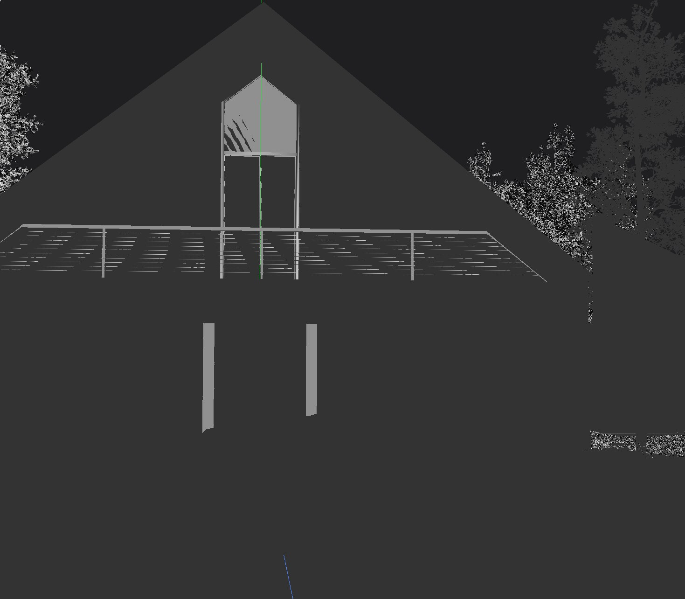
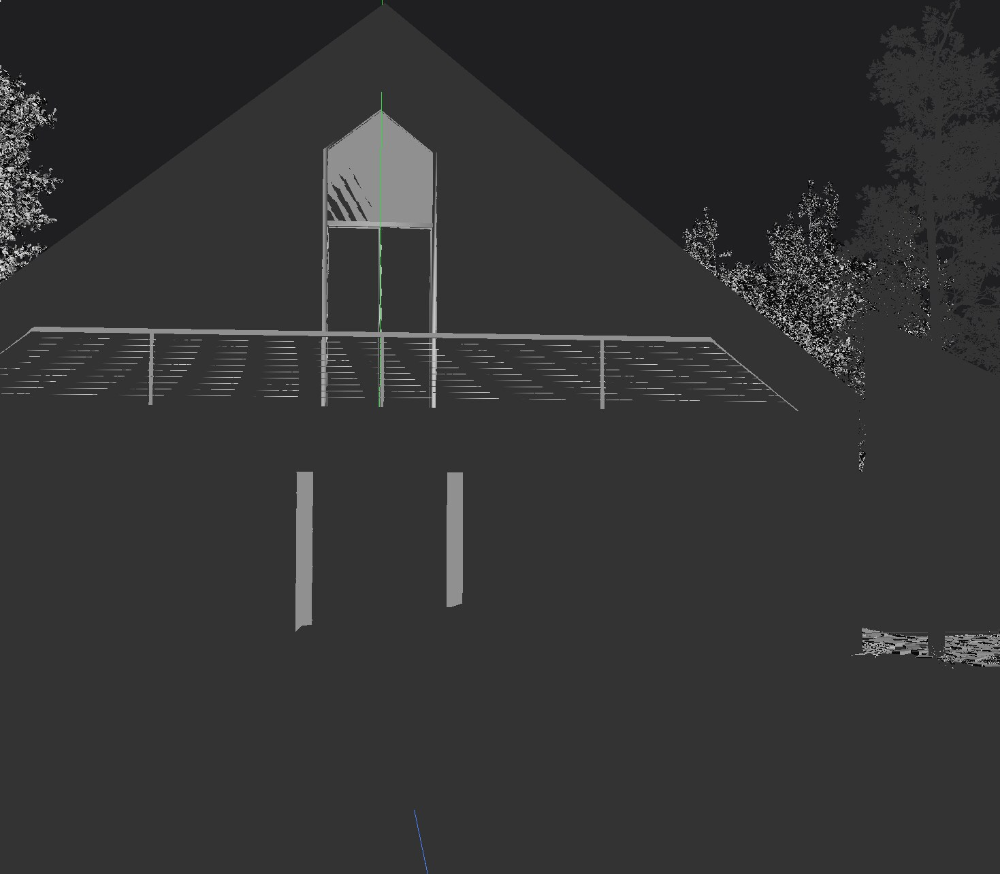

# Middle-scale USD scene benchmarks (tusdview)

Companion to [`large-scene.md`](large-scene.md) (Moana Island / Activision
Caldera, tens-of-millions-of-instances scenes that need streaming + view-
dependent LOD just to fit) and [`island-benchmark.md`](island-benchmark.md).
This file collects **middle-scale** public USD datasets — single rooms / single
properties, hundreds of thousands of instances at most — that load and render
**interactively without** the large-scene budgeting flags. They are useful
regression / shading / framing references that sit between the small `models/`
fixtures and the island-scale scenes.

## Host

* **CPU:** AMD Ryzen 9 3950X (16C/32T)
* **RAM:** 62 GiB
* **GPU:** NVIDIA GeForce RTX 5060 Ti, 16 GiB VRAM
* **Build:** `build/tusdview` (release), `--frames N` headless captures.
  Headless forces the **Vulkan** backend; GL numbers are captured windowed
  under `xvfb-run`. Wall / peak-RSS from `/usr/bin/time -v`; `present` (GPU +
  readback, ms) from `TUSDVIEW_TIME_FRAME=1` (last settled frame — use
  `--frames ≥ 4` so the projected-radius focal length settles, see
  [`large-scene.md`](large-scene.md) §2.6.5).

## Datasets

| Scene | Source | License | On-disk | Up-axis |
|-------|--------|---------|---------|---------|
| **Kitchen_set** | Pixar USD sample (`graphics.pixar.com/usd/downloads`) | Pixar USD Kitchen Asset EULA — **non-commercial testing only**, no redistribution | 287 KB root `.usd` + 5.3 MB `assets/` | **Z** |
| **Intel 4004 Moore Lane** (`v1.2.0`) | Intel / ASWF publicly released sample scene | Intel sample-scene terms (see bundled `Read_me.txt`) | 5.3 GB USD + 6.8 GB textures (~13 GB total) | Y |

Both are **local-only test assets** (`/mnt/disk1/data/usd/...`) — neither is
redistributed with TinyUSDZ; the EULAs above forbid it. Paths below are the
machine-local copies.

---

## 1. Kitchen_set (Pixar) — small interior, fully real-time

The classic Pixar kitchen: **1806 meshes, ~0.54 M triangles** (1.07 M after the
`--next` converter's triangulation), no point instancers. It is **Z-up** and an
*enclosed interior* — the auto-framer fits the whole bounding box, so a headless
capture shows the room shell from outside (the props are inside the walls); it is
best explored interactively by orbiting in. The `--next` lazy path frames it more
cleanly than the eager path (robust auto-frame, correct Z-up).

```sh
K=/mnt/disk1/data/usd/Kitchen_set/Kitchen_set.usd
# Vulkan rasterizer (headless):
./build/tusdview --headless --backend vk        $K --frames 4 --screenshot kitchen_vk.png
# Vulkan ray query:
./build/tusdview --headless --backend vk --rt   $K --frames 6 --screenshot kitchen_rt.png
# OpenGL (windowed; best shading) under Xvfb:
xvfb-run -a -s "-screen 0 1280x1024x24" \
  ./build/tusdview --backend gl                 $K --frames 4 --screenshot kitchen_gl.png
# Cleaner framing via the lazy loader:
./build/tusdview --headless --next --backend vk $K --frames 4 --screenshot kitchen_next.png
```

> _Screenshot omitted: Pixar's Kitchen_set EULA permits non-commercial
> testing only and forbids redistribution, so no rendered capture is
> bundled here. Reproduce locally with the command above._

| Path | Meshes / tris | Wall (load+render) | Peak RSS | `present` |
|------|---------------|--------------------|----------|-----------|
| OpenGL (windowed) | 1806 / 0.54 M | 3.5 s | 0.45 GiB | < 2 ms |
| Vulkan raster | 1806 / 0.54 M | 3.0 s | 0.70 GiB | < 2 ms |
| Vulkan ray query | 1806 / 0.54 M | 4.2 s | 0.69 GiB | ~0.1 ms |
| `--next` VK raster | 1 / 1.07 M | 3.0 s | 0.72 GiB | < 2 ms |

Comfortably real-time on every backend; the wall time is dominated by parse +
device/pipeline init, not drawing. A good shading / Z-up / interior-framing
regression fixture. (The `Kitchen_set_instanced.usd` variant loads identically on
the eager path, which flattens USD native instancing; `--next` is needed to
preserve instancing.)

---

## 2. Intel 4004 Moore Lane — single property, foliage-heavy exterior

A whole house + landscaped lot. The shipped entry point
`USD/MooreLane_ASWF_0623.usda` **sublayers** the point-instanced foliage
(`Instances/usd_pointInstances_0621.usd`, 223 MB) over the assembly, composing
via `--next` to **35 draws / 297,518 instances / 22.8 M unique tris** — but
**4.33 B *effective* tris** once instancing is expanded. This is the regime where
the per-frame [`--raster-lod`](large-scene.md#265-per-frame-view-dependent-raster-lod---raster-lod-tusdview)
pays off: a single exterior view can put **a billion** effective triangles in the
frustum.

The scene ships ~20 authored cameras (`MASTER_cameraExtended` plus
`cam_diningRoom_*`, `cam_livingRoomFireplace`, `cam_exteriorDrive`, …); frame them
with `--camera`. Interiors render near-black in the flat-shaded `--next` preview
(no scene lighting) — the **exterior** cameras are the useful headless shots.

```sh
M=/mnt/disk1/data/usd/Intel_mooreLane_v1_2_0/Intel_mooreLane/USD/MooreLane_ASWF_0623.usda
# Foliage-heavy exterior hero (40 GiB host cgroup, framing an authored camera):
systemd-run --user --scope -p MemoryMax=40G -p MemorySwapMax=2G \
  ./build/tusdview --headless --next --backend vk --camera cam_exteriorDrive \
    --max-tris 80000000 --frames 4 --screenshot moore_ext.png $M
# Same view, view-dependent LOD (collapse < 24 px to box proxies, drop < 1.5 px):
systemd-run --user --scope -p MemoryMax=40G -p MemorySwapMax=2G \
  ./build/tusdview --headless --next --backend vk --camera cam_exteriorDrive \
    --raster-lod --raster-lod-cull-px 1.5 --raster-lod-full-px 24 \
    --max-tris 80000000 --frames 4 --screenshot moore_ext_lod.png $M
```

Load is ~37 s (parsing 5.3 GB of USD), peak RSS ~5.4 GiB — fits the 16 GiB GPU
without any of the large-scene merge flags.

**Per-camera cost (VK raster, no LOD):**

| Camera | Visible / total instances | Drawn tris | `present` |
|--------|---------------------------|------------|-----------|
| `cam_diningRoom_01` (interior) | 7,302 / 297,518 | 118 M | ~779 ms |
| `cam_livingRoomFireplace` (interior) | 9,398 / 297,518 | 140 M | ~885 ms |
| `MASTER_cameraExtended` | 7,701 / 297,518 | 131 M | ~847 ms |
| **`cam_exteriorDrive`** (foliage) | **123,539 / 297,518** | **1.02 B** | **~5630 ms** |

**`cam_exteriorDrive` with `--raster-lod` (cull-px 1.5, full-px 24):**

| Mode | Full-detail instances | Drawn tris | `present` |
|------|----------------------|------------|-----------|
| LOD off | 123,539 | 1.02 B | ~5630 ms |
| LOD on (box proxies) | 1,715 | 102 M | **~655 ms** |

~**8.6×** faster present (5.6 s → 0.66 s), 10× fewer effective triangles, with the
near house + framing trees kept full-detail and only the distant foliage collapsed
to box proxies — visually near-identical:

| LOD off | LOD on (`--raster-lod`) |
|---------|--------------------------|
|  |  |

The fully-composed single-file variant
`USD/MooreLane_ASWF_0621_fullComposition.usda` (3.8 GB ASCII) renders the same
content but parses much slower than the sublayered entry; prefer
`MooreLane_ASWF_0623.usda`.

---

## Takeaways

* Both scenes load and render **interactively with the default flags** — no
  `--max-draw-meshes` / `--max-gpu-mem` merge needed (contrast
  [`large-scene.md`](large-scene.md) §2.6.4). Kitchen_set is sub-second to draw;
  Moore Lane interiors are ~0.8 s/frame.
* Moore Lane's **exterior foliage** view is the one case that benefits from
  `--raster-lod` (1.02 B → 102 M effective tris, ~8.6× present), making it the
  natural middle-scale regression for the per-frame view-dependent LOD path.
* Use **`--next`** for both: it gives correct Z-up + robust framing on
  Kitchen_set and preserves the point-instanced foliage on Moore Lane.
