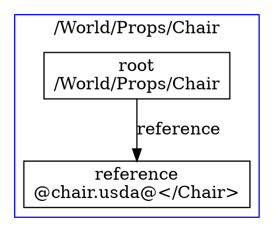

# PCP CLI Example

Command-line tool for exploring and testing TinyUSDZ's PCP (Prim Cache Population) composition engine.

## Features

- Compute prim indexes for any path in a USD scene
- Control payload inclusion
- Set variant selections
- Analyze composition structure
- Export composition graphs (DOT format)
- JSON-based instruction system for scripting composition operations
- BLAKE3-based instance detection

## Building

```bash
cd examples/pcp
mkdir build
cd build
cmake ..
make
```

## Usage

### Basic Usage

```bash
# Compute root prim index
./pcp_cli scene.usda

# With session layer
./pcp_cli -r scene.usda -s overrides.usda

# With JSON instructions
./pcp_cli scene.usda examples/basic_composition.json

# JSON output format
./pcp_cli scene.usda -f json -o result.json

# Generate DOT graph for visualization
./pcp_cli scene.usda -f dot -o graph.dot
dot -Tpng graph.dot -o graph.png
```

### Command Line Options

- `-r, --root <file>` - Root layer file (USDA)
- `-s, --session <file>` - Session layer file (optional)
- `-i, --instructions <file>` - JSON file with composition instructions
- `-f, --format <format>` - Output format: text, json, dot (default: text)
- `-o, --output <file>` - Output file (default: stdout)
- `--verbose` - Enable verbose output
- `--debug` - Enable debug mode
- `--benchmark` - Show timing information
- `--no-usd-mode` - Disable USD mode (enable full features)
- `--no-instancing` - Disable instance detection

## JSON Instruction Format

The PCP CLI uses JSON files to describe composition operations. See `composition_schema.json` for the full schema.

### Example: Basic Composition

```json
{
  "version": "1.0.0",
  "description": "Basic composition example",
  "instructions": [
    {
      "operation": "compute",
      "prim_path": "/World/Props/Chair",
      "parameters": {
        "cull_empty": true
      }
    },
    {
      "operation": "analyze",
      "prim_path": "/World/Props/Chair"
    }
  ]
}
```

### Supported Operations

1. **compute** - Compute prim index for a path
2. **include_payload** - Include a payload in the working set
3. **exclude_payload** - Exclude a payload from the working set
4. **set_variant** - Set variant selection
5. **set_expression** - Set expression variable
6. **invalidate** - Invalidate cached prim index
7. **query** - Query composition information
8. **analyze** - Analyze composition structure
9. **benchmark** - Run composition benchmark
10. **validate** - Validate expected results
11. **export** - Export composition data

### Query Types

- `nodes` - List all nodes in the prim index
- `arcs` - List composition arcs
- `dependencies` - Show dependency information
- `instances` - Find instance sharing
- `errors` - List composition errors
- `specs` - Show prim specs
- `children` - List child prims
- `properties` - List properties

## Examples

### 1. Reference Composition

```bash
./pcp_cli scene.usda examples/reference_composition.json
```

This explores how references are composed and shows the resulting node structure.

### 2. Variant Selection

```bash
./pcp_cli asset.usda examples/variant_composition.json
```

Tests variant selection and fallback behavior.

### 3. Payload Control

```bash
./pcp_cli heavy_scene.usda examples/payload_control.json
```

Demonstrates selective payload inclusion for managing scene complexity.

### 4. Instance Detection

```bash
./pcp_cli instanced_scene.usda examples/instance_detection.json
```

Shows how BLAKE3 hashing is used to detect and share identical composition structures.

### 5. LIVRPS Ordering

```bash
./pcp_cli complex_scene.usda examples/livrps_ordering.json
```

Tests the complete LIVRPS (Local, Inherit, Variant, Reference, Payload, Specialize) strength ordering.

## Output Formats

### Text Output (Default)

Human-readable output showing composition results, timing, and statistics.

### JSON Output

Structured JSON output suitable for parsing by other tools:

```json
{
  "results": [
    {
      "prim_path": "/World/Props/Chair",
      "success": true,
      "message": "Computed prim index",
      "details": {
        "has_specs": true,
        "is_instanceable": true,
        "num_nodes": 3,
        "instance_key": "a1b2c3d4..."
      }
    }
  ],
  "statistics": {
    "num_prim_indexes": 1,
    "num_nodes_created": 3,
    "time_elapsed_seconds": 0.001
  }
}
```

### DOT Output

GraphViz DOT format for visualizing composition graphs:



## Testing

Run the included tests:

```bash
# Run all tests
ctest

# Run specific test
./pcp_cli test_scene.usda examples/basic_composition.json

# Benchmark composition performance
./pcp_cli large_scene.usda --benchmark
```

## Architecture

The PCP CLI demonstrates:

1. **Cache Management** - Creating and configuring the PCP cache
2. **Layer Loading** - Loading USDA files as layers
3. **Prim Index Computation** - Building composition for specific paths
4. **Arc Processing** - Handling all composition arc types
5. **Instance Detection** - Using BLAKE3 for efficient instance key computation
6. **Dependency Tracking** - Understanding composition dependencies
7. **Change Processing** - Invalidation and recomputation

## Performance

The PCP implementation uses several optimizations:

- **Multi-level Caching** - PrimIndex, LayerStack, and instance key caches
- **BLAKE3 Hashing** - Fast cryptographic hashing for instance detection
- **Graph Culling** - Removing nodes with no opinions
- **Parallel Support** - Can compute multiple prim indexes in parallel

## See Also

- [TinyUSDZ PCP Documentation](../../src/tydra/README_PCP.md)
- [OpenUSD Composition](https://openusd.org/docs/USD-Glossary.html#USDGlossary-Composition)
- [BLAKE3 Specification](https://github.com/BLAKE3-team/BLAKE3)